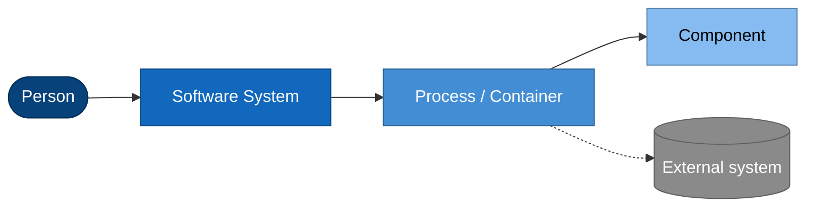

# container-desktop — Architecture documentation

A map of how container-desktop is built, for contributors and maintainers. It is
deliberately terse: diagrams first, narrative as captions, code paths so you can
jump to the source. It does **not** restate APIs line by line.

The app has two pillars, and the docs are organized around them:

- **Backend** — the engine/connection support: how the app models container
  engines (Podman, Docker, and Apple Container) and reaches them across local,
  SSH-remote, WSL, Lima, and machine/vendor hosts. (Apple Container is
  macOS/Apple-silicon only — native + SSH-remote, no WSL/Lima/vendor.)
- **Frontend** — the React renderer: UI, state, navigation, and the bridge that
  lets it drive the backend.

## Read in this order

| Doc                                                                      | What it covers                                                                                           |
| ------------------------------------------------------------------------ | -------------------------------------------------------------------------------------------------------- |
| [architecture/backend.md](architecture/backend.md)                       | Engine/connection support — C4 **Components** (L3): the Dialect × Transport × Profile composition.       |
| [architecture/connection-startup.md](architecture/connection-startup.md) | ★ The most intricate flow: establishing a connection to an engine at startup. Sequence + state diagrams. |
| [architecture/engine-matrix.md](architecture/engine-matrix.md)           | The engine × host × transport × scope support matrix and how a connection resolves.                      |
| [architecture/frontend.md](architecture/frontend.md)                     | React renderer — C4 **Components** (L3): stores, queries, screens, the Native bridge.                    |
| [architecture/overview.md](architecture/overview.md)                     | The whole system at a glance — C4 **Context** (L1) + **Containers** (L2). Start here.                    |
| [architecture/system-tray.md](architecture/system-tray.md)               | System tray — a native OS menu built and rebuilt in the main process, so it works with the app window closed. |
| [architecture/ai-subsystem.md](architecture/ai-subsystem.md)             | AI layer — C4 **Components** (L3): the main-only broker + gates (sender · egress · redaction), the always-agentic assistant and its **permission system** (3 modes · safety floor · user-managed allow/reject record · resolve/resume), key store, providers, and the Dockerfile/Compose generator. **The current reality of the whole feature.** |

## How to read the diagrams

Diagrams are [Mermaid](https://mermaid.js.org/) embedded in the markdown — GitHub
renders them inline, no tooling required. They follow the
[C4 model](https://c4model.com/): four zoom levels, of which we use three.

| C4 level         | Question it answers                                                   | Where             |
| ---------------- | --------------------------------------------------------------------- | ----------------- |
| **L1 Context**   | What is the system, who uses it, what does it talk to?                | overview          |
| **L2 Container** | What runnable pieces (processes/worlds) make it up?                   | overview          |
| **L3 Component** | What are the major parts inside a piece, and how do they collaborate? | backend, frontend |
| L4 Code          | (omitted — read the source via the per-doc _source map_ tables)       | —                 |

> **Naming clash, read carefully:** in C4 a **"container"** means a _runnable
> unit_ (a process / deployable), **not** an OS/Linux container. This app manages
> OS containers, so to avoid confusion the docs say **"process"** or **"world"**
> for the C4 sense and reserve "container" for the OS-container kind (Podman,
> Docker, Apple Container). Apple's engine is, confusingly, literally named
> `container` — an extra reason to keep the C4 sense spelled "process".

### Visual legend

Every flowchart uses the same C4 palette:

Solid arrows are in-process or direct calls; dashed arrows cross a process or host
boundary (IPC, socket, SSH).

## Scope & accuracy

These docs describe the **current** code, verified against source while writing.
Where the top-level [`CLAUDE.md`](../CLAUDE.md) onboarding guide and the code
disagree, the code wins: this documentation reflects the implementation. (For
example, the renderer uses **Zustand + TanStack Query/Router**, not the older
`easy-peasy`/`wouter` still named in `CLAUDE.md`.) Each doc ends with a **source
map** so you can confirm against the implementation.

The public, user-facing setup guides (install, per-OS configuration) live
separately under [`website-src/manual/`](../website-src/manual/) and are **not**
duplicated here.
