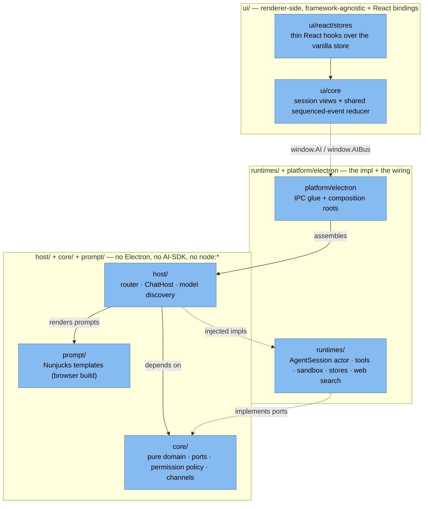
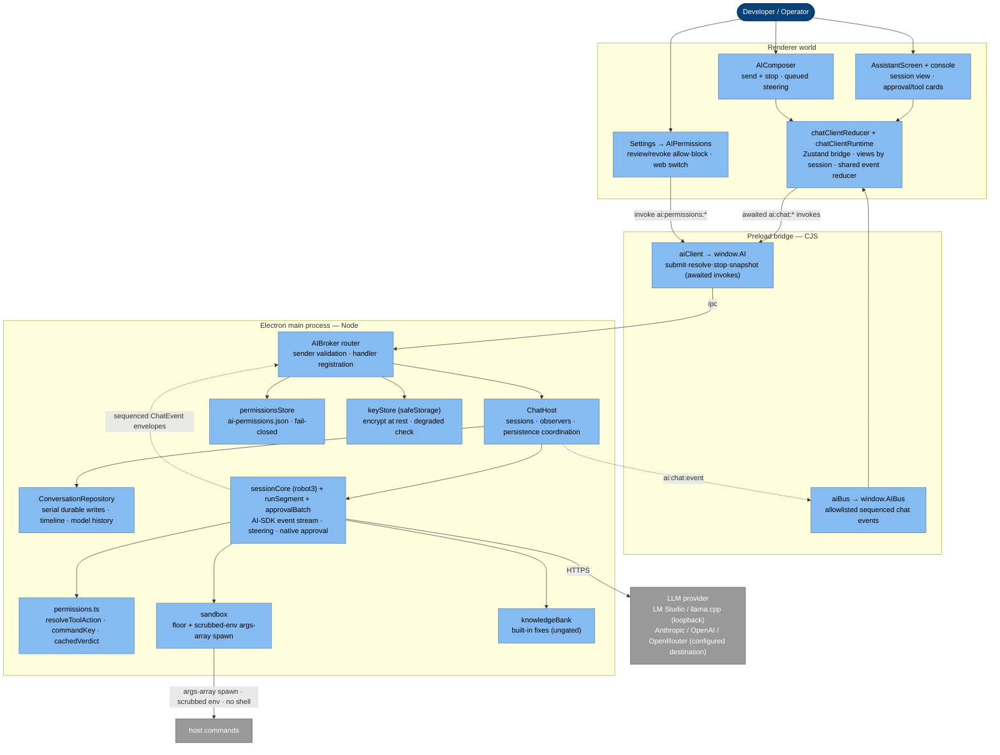
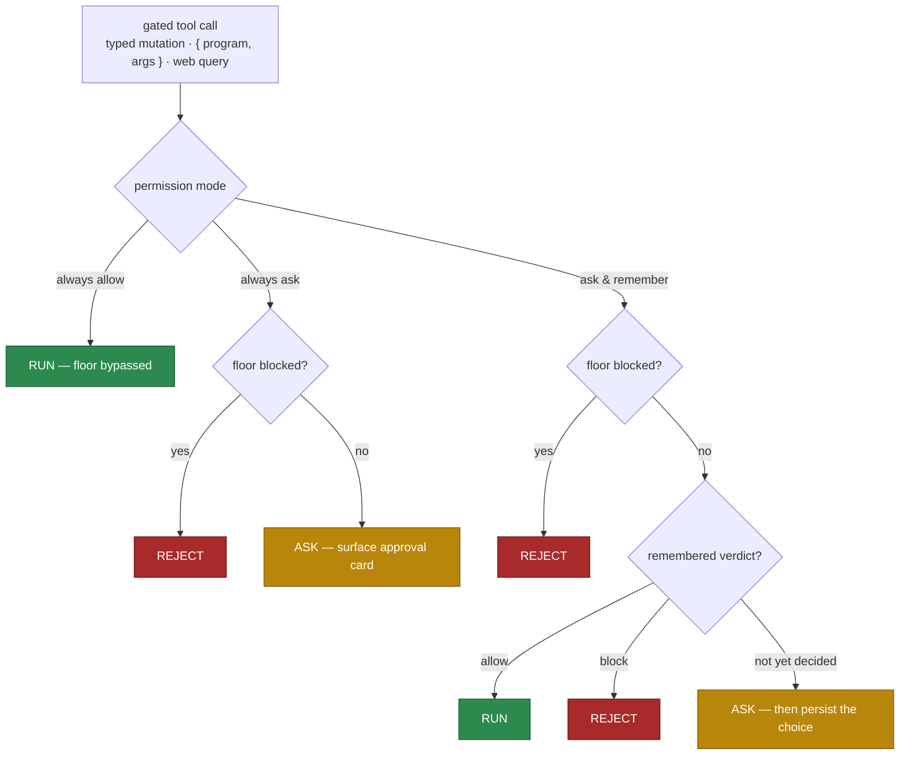
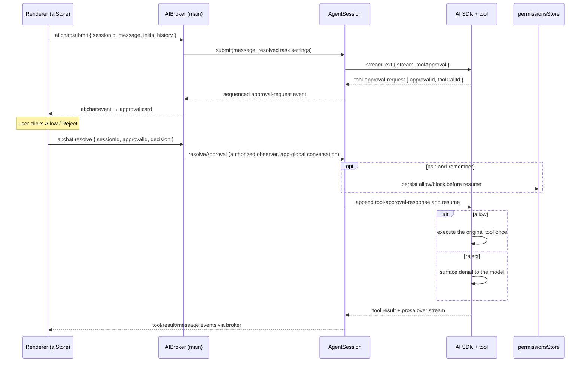
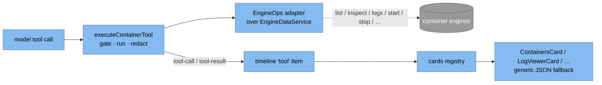

# AI subsystem

A **local-first** AI assistant for your container engines: one always-agentic conversation that can run
host commands to inspect and fix your setup — gated entirely by a permission mode you choose. It is an
expert in the Podman, Docker and Apple Container engines across local, SSH-remote, WSL and Lima/Colima access.

On **Electron** the governing rule matches the rest of the app: **main is the only authority** — provider keys,
provider HTTP calls, command execution, the permission record, and every security gate live in the **main
process**, and the renderer only ever sees a thin `window.AI` bridge. **This process boundary does not exist on
the single-realm Tauri/Wails shells**: there the broker, runtimes and provider calls run inside the webview realm
and the keychain hands plaintext keys to that trusted realm. Electron performs provider HTTP through main-side
Undici; Tauri/Wails deliberately use their webview's standard `fetch` and therefore depend on provider CORS and
streaming compatibility. No custom Rust/Go provider HTTP service is part of this architecture. The tool-permission
model below applies on every shell regardless.

The trusted-webview fetch adapter injects Anthropic's explicit direct-browser-access opt-in header for Tauri/Wails;
Electron's main-side path does not send it. Credential headers are constructed only in the shell-specific fetch
adapter and are never stored in actor context, inspection data, or provider request DTOs.

Tool execution is **consent, not a sandbox.** Once data reaches the configured provider — or if a local model is
compromised before it is run — the app cannot truly contain it. The selected provider configuration determines
that destination; the auditable, user-managed allow/reject record separately controls what tools may run.

## Architecture: ports & adapters

The subsystem is a self-contained library at `src/ai-system/`, layered so the core logic is
runtime-agnostic and unit-testable without Electron or the Vercel AI SDK. Layers contract through
**ports** (neutral interfaces in `core/`), not imports.

`core/` defines the neutral ports — `AgentSessionPort`, `CreateAgentSession`, `SandboxRunner`,
`KnowledgeBankLike`, `ConversationStore`, `AIKeyStore`, `PermissionsStoreLike` — and the **pure
permission policy** (`permissions.ts`). The small `host/` router validates senders and registers handlers;
`ChatHost` and `ModelDiscoveryHost` own their respective lifecycle state over injected
implementations; it never imports Electron, the AI SDK, Nunjucks, or `node:*`. Each runtime has a
platform composition root (`platform/electron/aiSystem.ts`) that assembles the
broker + runtimes (or scripted mocks); the runtime host only injects the shell surface (`ipcMain`/in-realm
transport, keychain, app paths, sender guard).

The **renderer is one Zustand vanilla store** (`ui/core/stores/aiStore.ts`) created with
`window.AI`/`window.AIBus` as injected getters — it never touches `window` or React directly;
`ui/react/stores` wraps it in thin `useStore(store, selector)` hooks.

## Why Electron is main-only

- **Secrets** — provider API keys are encrypted with the OS keychain (`safeStorage`) and decrypted *only*
  in main at call time; the renderer can set/clear/check a key but never reads plaintext back. *(Electron; on the
  single-realm Tauri/Wails shells the key is decrypted into the webview realm — see the shell caveat above.)*
- **Egress + execution** — whether a request leaves the device, and whether a command runs, must be
  decided where they actually happen, not in a renderer that can be inspected or bypassed.
- **CORS / origin** — Electron's main-side Undici path has no browser CORS restriction. Tauri/Wails use webview
  `fetch`, so supported provider/shell combinations must pass real-shell CORS and streaming verification.

On Electron, the renderer calls `window.AI.*` → preload relays over IPC → the **AIBroker** in main enforces the
gates, talks to the provider via the Vercel AI SDK, executes approved commands in a structural sandbox, and pushes
stream chunks back over an allowlisted bus. Tauri/Wails assemble the same broker and runtimes in their trusted
single webview realm and use an in-realm bus.

## Runtime shape (C4 L3 — Component)

## The permission system

The assistant is always tool-capable. What a **gated** tool call does — run, ask, or reject — is decided
by a single global **permission mode** plus a narrow safety **floor** and a user-managed allow/reject
**record**. Gated tools are the **typed container mutations** (start/stop/restart/pause/unpause/remove a
container, pull/remove an image, remove a network/volume) plus the generic `runCommand` and `webSearch`.
The **typed container reads** (list/inspect, logs, stats) and the built-in knowledge lookup have no
state-changing or network effect and run freely in every mode. (See [First-class typed tools &
generative-UI cards](#first-class-typed-tools--generative-ui-cards).)

The three modes (a global preference in `AISettings.permissionMode`, default **always ask**):

- **Always ask** — every gated call surfaces an approval card; the remembered record is ignored and
  nothing is persisted.
- **Ask and remember** — a call surfaces a card **only if not already decided**; a remembered allow runs
  silently, a remembered block is rejected silently, and a fresh decision is **persisted** so that exact
  command never asks again.
- **Always allow** — no prompt, no record, **no floor**: anything runs (the most dangerous mode, an
  explicit max-trust opt-in).

The whole decision is one pure function, `resolveToolAction({ mode, floorBlocked, cached })`:

### The floor

`isFloorBlocked(command)` is the only catastrophic check, enforced in **always ask** + **ask and
remember** and bypassed in **always allow**. It blocks a hardcoded denylist of destructive / privileged /
shell / network programs (`rm`, `sudo`, `ssh`, `bash`, `curl`, …), any shell metacharacter in an
argument, an invalid program token, or a `..` path-traversal segment. It is deliberately narrow: ordinary
reads are *asked for* (user consent), not hard-blocked — so reading a config file is a prompt, not a
silent allow nor a wall. `{` and `}` are allowed (engine `--format '{{json .}}'` Go templates are inert
without a shell); every other metacharacter is rejected.

### The record

The remembered allow/reject decisions live in a dedicated, versioned, app-global file —
`userData/ai-permissions.json` — owned by the broker (the renderer only sends a decision). Commands are
keyed by the exact `commandKey(program, args)`; web search is a single switch since queries vary. A
**block beats an allow** for the same key (`cachedVerdict`). Reads are **fail-closed**: a corrupt,
unreadable, or wrong-version file surfaces `status:"error"` with an empty record, and the broker forces
**always ask** for that run rather than honoring a dropped block. The file is managed from **Settings →
AI permissions** (review and revoke commands, set the web switch, reveal the file on disk). One in-memory
snapshot serves all conversations; mutations are serialized and written through a private temporary file plus
atomic rename. Memory changes only after persistence succeeds, so concurrent decisions cannot overwrite each
other and a failed write preserves the prior record. A successful remembered decision refreshes the current
task's policy immediately. Destructive typed-tool approval titles include their target connection id.

### Resolve, persist, resume

Approval uses AI SDK native `toolApproval`. The policy records its decision by SDK `toolCallId`; a request that
needs a person becomes an SDK-issued `approvalId`, which is the only id the renderer may resolve. The session
persists remembered verdicts before appending a native `tool-approval-response`. If persistence fails, it fails
closed and the tool does not run. An allowed tool then executes once through its normal `execute` function; the
broker never manually re-runs a command or engine operation.

## Security model

Every `ai:*` handler is wrapped by the broker. On Electron the checks run **in main, in order**, and the renderer
is not trusted to gate. On Tauri/Wails they run in the explicitly trusted single webview realm; that is a weaker
isolation boundary, not an Electron-equivalent security claim.

1. **Sender** — only an authorized app window may reach any handler. Conversation identity is app-global and
   independent from sender identity: authorized windows attach as observers, receive the same sequenced events,
   and may route commands to that conversation. Closing a window detaches its observer without disposing the task.
2. **Provider destination** — selecting a catalog provider or saving a custom provider endpoint is the explicit
   choice of where chat and model-discovery requests go. These primary model operations do not pass
   through the agent tool-permission system and do not require a second runtime endpoint grant. `auth:"none"`
   means the configured endpoint needs no secret; it does not erase that explicit destination choice. The actual
   boundaries are concrete: provider IDs/models are validated, endpoint URLs must use HTTP(S) without embedded
   credentials, credential injection is bound to the configured origin, requests are bounded/cancellable, and
   missing required credentials fail before transport. Public web search retains its separate SSRF/DNS/redirect
   controls because it fetches model-selected public URLs rather than a user-configured model endpoint.
3. **Redaction** — `redactPayload`/`redactText` strip provider-key prefixes, bearer tokens, JWTs, URL
   creds, and secret-looking env assignments from everything sent to a provider **and** from every command
   output before it re-enters the model.
4. **Keys** — never in `user-settings.json`; `safeStorage`-encrypted in `ai-credentials.json` (mode
   0600). On Linux `safeStorage` can degrade to `basic_text` (not real encryption) — the store detects it,
   the UI warns, and storing a cloud key then requires explicit opt-in.
5. **Permission mode + floor** — the gate above decides run/ask/reject. The mode is read per task; a fresh
   native approval in "remember" mode persists the verdict before execution resumes.
6. **Structural execution safety (every mode).** Independent of the permission decision, a command that
   runs goes through the sandbox: the tool API exposes only `{ program, args }` (a `.strict()` schema
   rejects a smuggled shell/cwd/env/wrapper); the sandbox builds the process options itself — fixed cwd, a
   **scrubbed allowlist env** (not the parent's), hard timeout, **no shell** — and spawns an **args array**
   via `sandboxExec.ts` (deliberately not the engine `Command.Execute`, whose `process.env` merge would
   re-introduce scrubbed secrets). Output is capped and redacted. Web search is SSRF-guarded (blocks reserved,
   private, loopback and link-local resolved IPs, re-checks redirects, and restricts the search fetch to its fixed
   origin) and its query is redacted before egress. Electron pins the approved address in its Undici lookup.
   Tauri/Wails currently use their trusted webview fetch after the same DNS checks and same-origin restriction;
   because that fetch may resolve the host again, their adapters carry explicit TODOs for a scoped Rust HTTP
   client and Go `net/http` service that can pin the approved address. In "always allow" the floor is skipped, but
   all of this structural safety still applies.

## The conversation & ordered timeline

Each app-global conversation owns one process-lifetime session, driven by a small **robot3** lifecycle machine
(`sessionCore`) behind `AgentSessionPort`. It owns the canonical AI SDK `ModelMessage[]`, current task/segment,
pending inputs, native approvals, and a sequenced `ChatSessionView`. A host `ConversationRepository` owns
versioned metadata and serialized persistence in `userData/ai-conversations.json`; authorized windows attach as
observers rather than owning the conversation. Every submit uses `ai:chat:submit`; the machine decides — by its
current state — whether it starts a task, interrupts a model call, or queues the message behind a running tool.

During a model call, a new message freezes the partial assistant bubble as **Interrupted**, aborts that segment,
and continues the same task with the partial assistant text plus the inserted user turn in canonical history. Each
model call gets its own `AbortController`, with the task-level Stop relayed into it — so steering can cut a segment
without ending the task, and only Stop is terminal. Only the partial *text* is kept: a partial `tool_use` block
would have no matching `tool_result`, which providers reject. During a tool call, the message is shown as
**Queued**; the tool settles exactly once and the queued messages are spliced in before the next model call,
merging into the tool-result turn rather than opening a second consecutive user turn. Duplicate message ids are
idempotent. Stop aborts a model immediately, but lets an already-running tool settle without starting another
model call.

Every terminal exit (model error, Stop in any phase, dispose) runs one shared `terminalCleanup` — drain queued
inputs, release+clear held approvals, drop buffered responses — so a held approval can never wedge the next submit.
A stream failure, a finish reason of `error`, and a provider `abort` are all terminal-distinct (error / stopped),
never a false completion. Cancelling an approval (including mid-persist, where Stop wins over a pending
remembered-write) appends a reject `tool-approval-response` for every open call so the next task cannot hit a
missing-tool-result. Transport delivery is best-effort and fully contained: an emit — or the logger inside its own
catch — can never crash the authoritative actor.

The session core and renderer both use `reduceChatEvent`. Envelopes carry `sessionId`, stable item ids, and a
monotonic `seq`; duplicates are ignored and gaps trigger bounded snapshot recovery with buffered replay. The
renderer runtime hydrates on start, owns its bus subscription and task registry, coalesces snapshot waiters,
and tombstones deleted conversations against late results. Zustand is only its read-only React projection: public
callers can send runtime commands and read snapshots, but cannot call `setState`. The development transcript fixture
also enters through an explicit runtime event rather than mutating the mirror.

Session updates fold through **immer**, so a retained snapshot is frozen and never changes after a later command. Queued steering crosses an explicit `QUEUE_INPUT` message to
the invoked segment instead of closing over mutable parent state. Every state carries a `phase:*` tag; command
outcomes derive phase from those tags, while `ChatSessionView.phase` is only the synchronized public projection.

Streaming assistant text is held in a small immutable overlay (`id`, timeline index, accumulated content) until
`assistant-end`. Each delta therefore updates one object while the long timeline array remains referentially
stable; the completed/interrupted/stopped text is committed into the timeline once at the terminal event. The
renderer reads the overlay directly, and restart normalization commits any recovered partial before marking it
stopped.

Durability stores the redacted rich timeline, provider/model metadata, last sequence, and canonical compact model
history. Writes use a private temporary file followed by atomic rename and are serialized by a small promise queue;
a failed write does not commit the mutation. On restart, in-flight messages/tools/approvals are normalized to a
stopped/rejected terminal projection and no model or tool operation resumes automatically. Active selection is a
separate renderer preference. The shared history strip keeps background work and approvals navigable after
**New chat**.

### Resource ceilings and watchdogs

Shared constants in `core/limits.ts` bound the runtime as well as persisted data. At most 16 non-idle conversation
actors may run concurrently; idle/error actors can be unloaded without
deleting their durable conversation. A diagnostics bundle is capped at 256,000 characters and the in-memory
composer history retains its newest 100 entries. Durable storage retains at most 100 conversations, 5,000 timeline
items and 2,000 canonical model messages per conversation, with file/record byte ceilings; a full conversation
returns an explicit "start a new chat" error instead of silently losing history.

Each model segment has a ten-minute total deadline and a 60-second stream-idle deadline. Typed engine operations
have a two-minute deadline and settle through the normal redacted tool-error path, so Stop cannot remain pinned to
an engine promise forever. Provider-fetch byte/time bounds remain in the provider transport; provider-specific
discovery bounds are owned by their dedicated operation work.

The composer shows **Send and Stop together** while steering is possible. Provider and permission controls stay
fixed during an active task. Approval/stopping phases block Send; rejected submits keep the draft. The transcript
auto-follows new output and demagnetizes when the user scrolls up, with a bottom-center button to re-follow.

### State machines & runtimes (robot3 + closures)

XState was removed. Ordering is guaranteed by a small **non-reentrant FIFO dispatcher** per owner — a `send` inside
a reducer or action enqueues and never recursively transitions — the guarantee the framework's internal queue gave.

- **Host — `runtimes/agent/session/sessionCore.ts`** — a tiny **robot3** lifecycle machine:
  `idle` · `runningSegment` · `settling` · `interrupting` · `approvalBatch` · `error` · `disposed`; model/tool/stop
  are a `phase` in context, updated without leaving `runningSegment`. The streaming turn is spawned **manually**
  (not a robot3 invoke — robot3 has no internal transitions and restarts an invoke on self-transition): an epoch +
  `AbortController` token owns the segment across the interrupt/stop windows, and leaving it aborts and drops its
  late events — the staleness guard, made explicit. Projection lives in the service (`session/project.ts` →
  `session/state.ts`, folded with **immer** so a retained snapshot is frozen and cannot change after a later
  command). `session/approvalBatch.ts` owns decision serialization, remembered-permission persistence, cancellation,
  completion, and repair. `AgentSession.ts`'s `createAgentSession` factory + `createSessionActor` build the seeded
  core behind the unchanged `AgentSessionPort`.
- **Renderer — `ui/core/stores/chatClientReducer.ts` + `chatClientRuntime.ts`** — a **pure reducer**
  `(state, event) => { state, effects }` owns hydration, lossless snapshot recovery, tombstones, and the session
  list; the runtime is its effect executor — the FIFO dispatcher plus a **task registry** that runs each host call
  and feeds the resolution back as `REQUEST_DONE` / `REQUEST_FAILED`, the bus subscription, and the one-shot
  hydration load. Concurrent host calls (submit / resolve / stop / dispose / snapshot) run as independent registry
  tasks, so an in-flight request never blocks incoming deltas. `aiStore.ts` binds it to React: a vanilla Zustand
  store projects runtime state (`onChange → store.setState(derive())`) and correlates command outcomes to Promises,
  preserving the `useAIStore((s) => s.x)` API without exporting a mutation method.
**Visualizing & testing.** `robot3-viz` (dev-only, never shipped) renders `sessionCore` from source. The former
`@statelyai/inspect` live inspector was removed with XState. Coverage is behavioral: `sessionCore` through
`AgentSession.test.ts`, the renderer reducer through `chatClientRuntime.test.ts` + `aiStore.test.ts`, and the full
submit→stream→steer→project path through `host/chatSteering.integration.test.ts`.

## First-class typed tools & generative-UI cards

Beyond the generic `runCommand` escape hatch, the assistant drives the engines through **typed container
tools** — `listContainers`, `inspectContainer`, `getContainerLogs`, `getContainerStats`, the same
list/inspect for images, networks and volumes, and the gated mutations (`startContainer` / `stopContainer`
/ `restartContainer` / `pauseContainer` / `unpauseContainer` / `removeContainer`, `pullImage` /
`removeImage`, `removeNetwork` / `removeVolume`). Each is an AI-SDK tool with a `.strict()` Zod schema. Entity
operations accept only their id/reference plus the explicit optional `connectionId`; arbitrary fields, shell
options, cwd and environment overrides are rejected. They reach the real engines
through the **`EngineOps` port** (`core/types.ts`), implemented by
`platform/engineOpsAdapter.ts` over the live `EngineDataService` — the same host clients +
container-client adapters the rest of the app uses — so keys and execution stay in the runtime-owned engine
service, exactly like `runCommand`. Lifecycle ops route through `EngineDataService.performAction` so the resource snapshot
refreshes.

Reads run freely; mutations go through the session's one native-approval policy (run / ask / reject), keyed by
`toolKey(name, args)` — the same shape as `commandKey`, persisted via `toolRule` so a "remember" verdict on
`removeContainer{id}` survives. An approved mutation executes through the tool's ordinary `execute` function;
there is no broker re-execution path. Every tool returns `ToolOutputEnvelope { ok, display, model }`: `display`
feeds the UI card while `toModelOutput` serializes only the compact `model` value into LLM history. Both are
redacted before leaving the runtime.

`AgentSession` maps AI SDK event-stream tool parts into addressed `tool-start` / `tool-result` events. The shared
chat reducer grows a `tool` item by `toolCallId`, and a **card registry**
(`web-app/components/ai/cards/registry.tsx`) renders it as a Blueprint card themed with `--app-*`:
`ContainersCard` (state-tagged table), `ImagesCard`, `NetworksCard`, `VolumesCard`, `LogViewerCard`, and
`ActionResultCard` for a mutation outcome. A tool with no registered card falls back to a titled JSON view,
so adding a tool never breaks the transcript. The runtime and card registry share one `ContainerToolName` union;
the generic fallback applies defense-in-depth redaction before rendering.

## Provider model

One abstraction covers everything via the Vercel AI SDK: local servers **and** OpenAI-compatible clouds
use `@ai-sdk/openai-compatible` (just a different `baseURL`); Anthropic and OpenAI use their dedicated
providers. `resolveProvider` (pure) decides id/kind/baseURL/model/requiresKey; `createLanguageModel` turns that
into a `LanguageModel` backed by the shell-specific fetch adapter. Construction is lazy.
Default local base URLs are loopback: llama.cpp `:8080/v1`, LM Studio `:1234/v1`. The model is selected in
the shared `AIComposer` and persisted to `ai.providers[id].model`; the renderer sends it per request and
the broker honors that per-request model, falling back to the settings model when absent.

Model discovery is provider-specific. `resolveProvider` carries an `openai-compatible`, `anthropic`, `single` or
`manual` strategy into the broker. The runtime uses bounded streaming JSON reads, model/id/page ceilings, a
15-second deadline and caller cancellation. OpenAI-compatible endpoints paginate with `after`; Anthropic uses its
documented `anthropic-version` header and `after_id`; a single-model server may fall back to its explicitly saved
model when no discovery endpoint exists; a manual provider performs no discovery request. The renderer cache is
TanStack Query, keyed by provider id, complete normalized endpoint, auth scheme metadata and a non-secret
credential revision. Mounted composers therefore deduplicate the same request, configuration/key changes cannot
reuse stale data, and forced refresh aborts the correlated broker request before replacing it. Provider connection
fields are saved as one explicit settings mutation rather than asynchronous per-keystroke writes.

Public web search has a separate explicit master enable setting in addition to its permission verdict. Every shell
offers it: Electron uses the address-pinned main transport, while Tauri/Wails use the constrained trusted-webview
fallback described in the security section pending their native-client TODOs. The UI never reports a remembered
allow as active when the feature itself is disabled or unavailable.

## Prompt templates

System prompts are Nunjucks templates (`.md` with `` conditionals): the agent prompt (the live
assistant). Tool descriptions and the built-in troubleshooting bank are also prompt
markdown resources rather than prose embedded in TypeScript. `renderPrompt` provides a single `nunjucks.Environment` with
`autoescape:false`, importing the **browser build** so `prompt/` carries no Node dependency and can sit at
the package root. Templates load via Vite's `?raw` in production and inline strings in tests.

The agent prompt also renders a **Current screen** block from `DiagnosticsBundle.screen` — a compact,
model-facing summary (`ui/core/screenContext.ts`) of the screen the user is on, plus that screen's *focus*
guidance from the **per-screen prompt registry** (`prompt/screenPrompts.ts`, keyed by screen id with domain
bases → sub-screen overrides → generic fallback). The same registry supplies the starter-question chips
shown in the console's empty state.

## Typed transport protocol

`core/channels.ts` is the single request/response/push channel map. Electron IPC and the shared trusted-webview
adapter preserve those channel generics end to end; raw receive payloads remain `unknown` until
`core/schemas.ts` validates them. The broker validates every invoke request, the renderer bridge validates
every invoke response, and the bus validates every push envelope before it reaches a reducer. Tauri and Wails use
the same `inRealmBus`, AI client/bus bridge, webview composition root and lifecycle host; their shell files retain
only native keychain/DNS/execute construction and invoke types.

## Screen gating & navigation

AI screens opt in with `Metadata.RequiresAI` **and** `Metadata.ExcludeFromSidebar` — they are kept out of
the sidebar and reached through a split-button **AI menu in the header**: the **main button toggles the
summonable Assistant console**, and the caret lists every AI screen (the full-page Assistant, Goals and
Workers).

The **Assistant console** (`components/ai/AssistantConsole/`) is a single app-wide host portaled to
`<body>` so it overlays the full app width (over the sidebar). Its primary form is a bottom *quake* drawer
(5px margins, `data-variant` also supports top/right/center) opened with the quake shortcut (mod + backtick,
i.e. Ctrl or Cmd plus the backtick key) or the header button and dismissed with Escape (when idle). It renders the **same `AssistantConversation`** as the
full-page Assistant against one `useAIStore` session, so a chat is continuous across surfaces. Open/variant/
opacity live in `uiStore` (`assistantConsole` slice); a transparency slider (quake variants) drives
`--console-opacity`. `AppLayout` publishes the active screen's id/title to `uiStore.currentScreen`, which
feeds both the console's context chip and the assistant's screen-context collector.

## Mock mode

When `CONTAINER_DESKTOP_MOCK=1`, `aiMocks.ts` supplies an AI SDK v3-compatible streaming language model plus
fixture `EngineOps`, sandbox, knowledge, web, model catalog, and permission stores. The mock emits real model
text/tool-call chunks, so the production `sessionCore`, event stream, native approval, steering, queuing, and
cards all run unchanged. General replies stream slowly enough to steer live; prompts mentioning containers/images/
networks/volumes invoke the matching typed tool; mutation prompts exercise the native approval path.

## Source map

| Path | Role |
| ---- | ---- |
| `core/permissions.ts` | `AIPermissionMode`, `resolveToolAction`, `commandKey`/`toolKey`/`toolRule`, `cachedVerdict`, the cache + store-port types |
| `core/{chatEvents,chatReducer,conversations}.ts` | sequenced chat protocol, shared projection, durable record/store behavior |
| `core/{channels,schemas}.ts` | typed invoke request/response + push maps and authoritative runtime trust-boundary schemas |
| `core/{ports,types,settings,redact,providers,limits,toolNames}.ts` | shared ports/types, redaction, provider configuration/transport, typed engine ops/tool names, resource ceilings |
| `resources/ai/*.json` | validated provider, tool-presentation, mock-model, knowledge, permission, and engine fixture data |
| `host/{broker,chatHost,modelDiscoveryHost,conversationRepository}.ts` | routing, real lifecycle owners (closure factories, not classes), serial durable coordination, provider/context resolution |
| `runtimes/conversationFileStore.ts` | bounded private temp-file/atomic-rename conversation persistence |
| `runtimes/permissionsStoreCore.ts` | single-writer, atomic file-backed allow/reject record (fail-closed) |
| `runtimes/agent/session/{sessionCore,state,project,approvalBatch,types}.ts` | host chat lifecycle (**robot3** `sessionCore`) + immer-folded projection/state, serial approval batch, typed events |
| `runtimes/agent/{AgentSession,segmentActor,segment/runSegment,toolPolicy,toolOutput,tools,containerToolSpecs,containerTools,sandbox,webSearch}.ts` | session factory (`createAgentSession`/`createSessionActor`), segment stream types + `mapStreamPart` + processor, native approval, tool specifications/execution, output envelopes, safety |
| `runtimes/{languageModel,localModels,devKeys}.ts` | model construction/provider-specific bounded discovery; dev API keys (the encrypted key store + credentials are the platform `capabilities/keychain` port + electron `credentialsFs.ts`, injected) |
| `platform/engineOpsAdapter.ts` | the `EngineOps` port implemented over the live `EngineDataService` (typed container ops) |
| `prompt/{prompts,renderPrompt,markdownSections}.ts`, `resources/prompts/` | Nunjucks prompt builders, markdown record parser, system/tool/knowledge prose resources |
| `ui/core/{toolTitle,stores/{chatClientReducer,chatClientRuntime,aiStore}}.ts` | localized tool-title formatting, renderer chat **pure reducer** + effect runtime, and the Zustand bridge exposing the `AIState` store API |
| `ui/react/stores/useAIStore.ts` | React hook + the diagnostics-bundle collector |
| `platform/electron/aiSystem.ts` | runtime composition roots (assemble broker + runtimes / mocks; wire `engineOps`) |
| `platform/electron/aiSystemHost.ts` | broker lifecycle hosts |
| `platform/electron/{aiClient,aiBus}.ts` | `window.AI` forwarder + receive bus |
| `platform/{inRealmBus,webviewAI,webviewAISystem,webviewAISystemHost}.ts` | shared Tauri/Wails trusted-webview AI transport, composition and lifecycle |
| `web-app/screens/AI/AssistantScreen.tsx`, `web-app/components/AIComposer.tsx`, `web-app/screens/Settings/AIPermissions.tsx` | the screens + composer |
| `web-app/components/ai/cards/` | the generative-UI card registry + cards (Containers/Images/Networks/Volumes/LogViewer/ActionResult) |

## Testing strategy

- **Pure logic, TDD** — `permissions` (every effects cell: allow-ignores-floor+cache, ask-ignores-cache,
  remember branches, the floor, `commandKey`), settings, redact, providers, chat-event reducer,
  model choice — real behavior, no mocks, hermetic in Vitest.
- **DI for host-coupled pieces** — stores/keychain use fakes; `AIBroker` tests app-global actor reuse,
  observer convergence/detach, durable model history, validation/redaction, awaited controls, and snapshots.
- **Agent stack, TDD** — sandbox floor + `executeSandboxed` (scrubbed env, `enforceFloor:false` bypass,
  caps, redaction), web search (SSRF + redirect/size caps + query redaction), tools (`{program,args}`-only
  schema), typed tools and output envelopes, native tool policy, the `sessionCore` robot3 machine (via the
  `AgentSession` port behavior: steering/tool-boundary/approval/Stop races), the `mapStreamPart` stream mapper,
  full renderer→broker→real-session steering integration, and the renderer
  `chatClientRuntime` + `aiStore` bridge.
- **Live / CDP** — the Assistant, the permission dropdown + approval cards, and Settings → AI permissions
  are verified via the standard CDP smoke against the running dev build.
