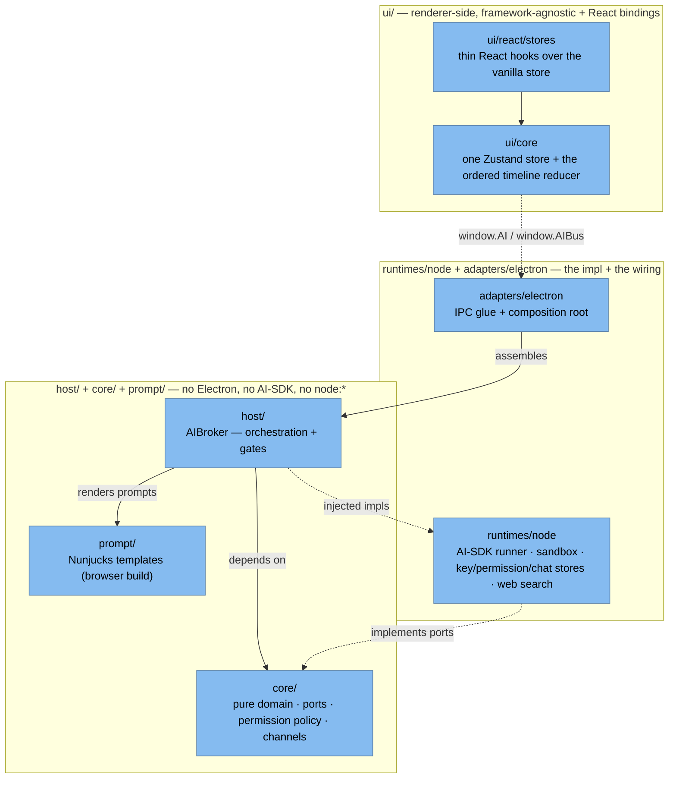
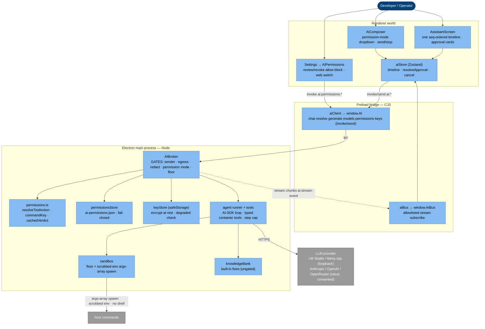
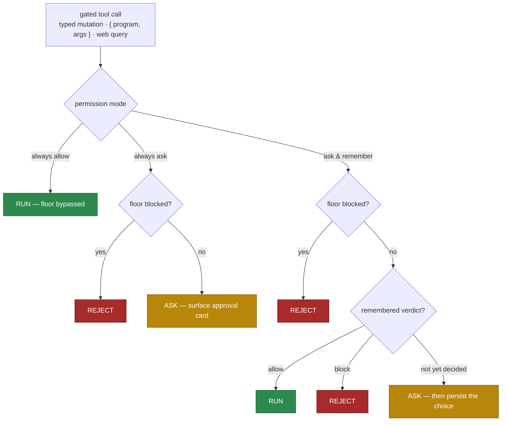
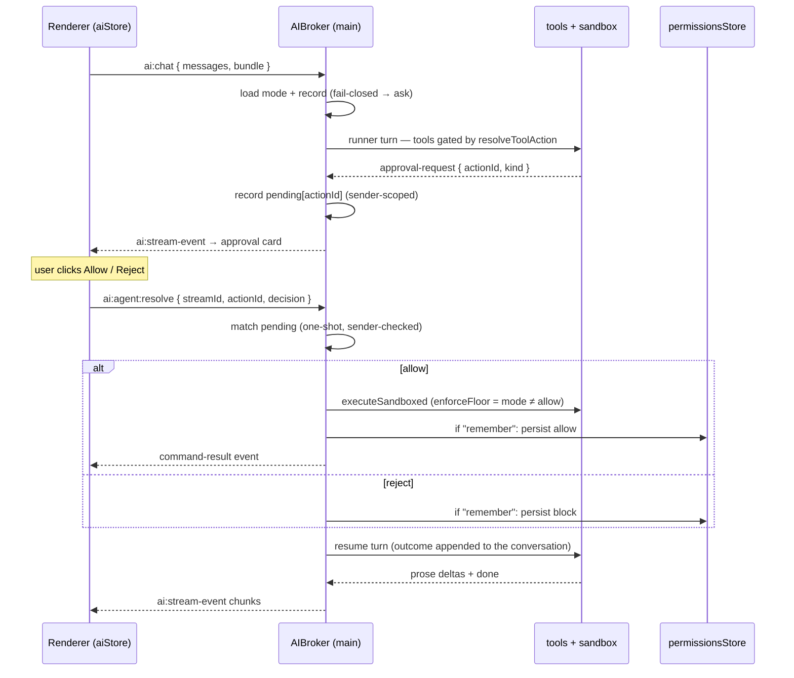
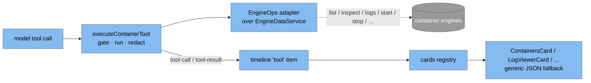

# AI subsystem

A **local-first** AI assistant for your container engines: one always-agentic conversation that can run
host commands to inspect and fix your setup — gated entirely by a permission mode you choose — plus a
Dockerfile/Compose generator. It is an expert in the Podman, Docker and Apple Container engines across
local, SSH-remote, WSL and Lima/Colima access.

The governing rule matches the rest of the app: **main is the only authority**. Provider keys, provider
HTTP calls, command execution, the permission record, and every security gate live in the **main
process**. The renderer only ever sees a thin `window.AI` bridge.

This is **consent, not a sandbox.** Once data leaves the machine — or if a local model is compromised
before it is run — the app cannot truly contain it. So the system's job is explicit user consent plus an
auditable, user-managed allow/reject record. What runs is decided by the user, never by a heuristic.

## Architecture: ports & adapters

The subsystem is a self-contained library at `src/ai-system/`, layered so the core logic is
runtime-agnostic and unit-testable without Electron or the Vercel AI SDK. Layers contract through
**ports** (neutral interfaces in `core/`), not imports.

`core/` defines the neutral ports — `SandboxRunner`, `AgentRunner`, `BuildAgentTools`,
`KnowledgeBankLike`, `ModelLister`, `ChatStore`, `AIKeyStore`, `PermissionsStoreLike` — and the **pure
permission policy** (`permissions.ts`). The `host/` broker orchestrates over those ports and injected
implementations; it never imports Electron, the AI SDK, Nunjucks, or `node:*`. The Electron composition
root (`adapters/electron/main/createElectronAISystem.ts`) is the single place that assembles the broker +
Node runtimes (or the scripted mocks); `main.ts` only injects the Electron surface (`ipcMain` transport,
`safeStorage`, app paths, the main-window sender guard).

The **renderer is one Zustand vanilla store** (`ui/core/stores/aiStore.ts`) created with
`window.AI`/`window.AIBus` as injected getters — it never touches `window` or React directly;
`ui/react/stores` wraps it in thin `useStore(store, selector)` hooks.

## Why main-only

- **Secrets** — provider API keys are encrypted with the OS keychain (`safeStorage`) and decrypted *only*
  in main at call time; the renderer can set/clear/check a key but never reads plaintext back.
- **Egress + execution** — whether a request leaves the device, and whether a command runs, must be
  decided where they actually happen, not in a renderer that can be inspected or bypassed.
- **CORS / origin** — Anthropic/OpenAI reject browser-origin calls; a Node main process has no such limit.

The renderer calls `window.AI.*` → preload relays over IPC → the **AIBroker** in main enforces the gates,
talks to the provider via the Vercel AI SDK, executes approved commands in a structural sandbox, and
pushes stream chunks back over an allowlisted bus. Same Broker + bridge pattern as the engine-HTTP proxy
and resource sync.

## Runtime shape (C4 L3 — Component)

## The permission system

The assistant is always tool-capable. What a **gated** tool call does — run, ask, or reject — is decided
by a single global **permission mode** plus a narrow safety **floor** and a user-managed allow/reject
**record**. Gated tools are the **typed container mutations** (start/stop/restart/pause/unpause/remove a
container, pull/remove an image, remove a network/volume) plus the generic `runCommand` and `webSearch`.
The **typed container reads** (list/inspect, logs, stats) and the built-in knowledge lookup have no
state-changing or network effect and run freely in every mode. (See [First-class typed tools &
generative-UI cards](#first-class-typed-tools--generative-ui-cards).)

The three modes (a global preference in `AISettings.permissionMode`, default **always ask**):

- **Always ask** — every gated call surfaces an approval card; the remembered record is ignored and
  nothing is persisted.
- **Ask and remember** — a call surfaces a card **only if not already decided**; a remembered allow runs
  silently, a remembered block is rejected silently, and a fresh decision is **persisted** so that exact
  command never asks again.
- **Always allow** — no prompt, no record, **no floor**: anything runs (the most dangerous mode, an
  explicit max-trust opt-in).

The whole decision is one pure function, `resolveToolAction({ mode, floorBlocked, cached })`:

### The floor

`isFloorBlocked(command)` is the only catastrophic check, enforced in **always ask** + **ask and
remember** and bypassed in **always allow**. It blocks a hardcoded denylist of destructive / privileged /
shell / network programs (`rm`, `sudo`, `ssh`, `bash`, `curl`, …), any shell metacharacter in an
argument, an invalid program token, or a `..` path-traversal segment. It is deliberately narrow: ordinary
reads are *asked for* (user consent), not hard-blocked — so reading a config file is a prompt, not a
silent allow nor a wall. `{` and `}` are allowed (engine `--format '{{json .}}'` Go templates are inert
without a shell); every other metacharacter is rejected.

### The record

The remembered allow/reject decisions live in a dedicated, versioned, app-global file —
`userData/ai-permissions.json` — owned by the broker (the renderer only sends a decision). Commands are
keyed by the exact `commandKey(program, args)`; web search is a single switch since queries vary. A
**block beats an allow** for the same key (`cachedVerdict`). Reads are **fail-closed**: a corrupt,
unreadable, or wrong-version file surfaces `status:"error"` with an empty record, and the broker forces
**always ask** for that run rather than honoring a dropped block. The file is managed from **Settings →
AI permissions** (review and revoke commands, set the web switch, reveal the file on disk).

### Resolve, persist, resume

An approval is explicit and one-shot. The tool surfaces an `approval-request` carrying a main-issued
`actionId`; the renderer echoes that id back in a `resolve` — it never invents one — so the broker matches
the exact pending action it actually surfaced. A reject **never** runs. After the decision the broker
appends the outcome to the conversation and starts a **follow-up runner turn** on the same stream, so the
model sees the result and continues — every resume is human-triggered, so there is no auto-loop in
ask/remember (each turn is itself bounded by the runner's step cap).

## Security model

Every `ai:*` handler is wrapped by the broker; the checks run **in main, in order**, and the renderer is
never trusted to gate.

1. **Sender** — only the main app window may reach any handler. A `resolve` additionally must come from
   the same sender that opened the stream.
2. **Egress** — a call is *off-device* iff its resolved `baseURL` host is non-loopback. Consent for cloud
   is the **stored API key**: a key-requiring provider with no key is refused; pointing a local provider
   at a remote URL is itself the explicit act. Loopback stays on-device.
3. **Redaction** — `redactPayload`/`redactText` strip provider-key prefixes, bearer tokens, JWTs, URL
   creds, and secret-looking env assignments from everything sent to a provider **and** from every command
   output before it re-enters the model.
4. **Keys** — never in `user-settings.json`; `safeStorage`-encrypted in `ai-credentials.json` (mode
   0600). On Linux `safeStorage` can degrade to `basic_text` (not real encryption) — the store detects it,
   the UI warns, and storing a cloud key then requires explicit opt-in.
5. **Permission mode + floor** — the gate above decides run/ask/reject. The mode is read per run; a fresh
   `resolve` in "remember" mode persists the verdict.
6. **Structural execution safety (every mode).** Independent of the permission decision, a command that
   runs goes through the sandbox: the tool API exposes only `{ program, args }` (a `.strict()` schema
   rejects a smuggled shell/cwd/env/wrapper); the sandbox builds the process options itself — fixed cwd, a
   **scrubbed allowlist env** (not the parent's), hard timeout, **no shell** — and spawns an **args array**
   via `sandboxExec.ts` (deliberately not the engine `Command.Execute`, whose `process.env` merge would
   re-introduce scrubbed secrets). Output is capped and redacted. Web search is SSRF-guarded (blocks
   private/loopback/link-local by resolved IP, re-checks redirects) and its query is redacted before
   egress. In "always allow" the floor is skipped, but all of this structural safety still applies.

## The conversation & ordered timeline

There is one always-agentic conversation on the `ai:chat` channel — no mode toggle. The broker attaches
the gated tools, builds the agent prompt from the redacted context bundle, and streams prose `delta`s plus
a `tool` timeline (commands, results, typed tool calls/results rendered as cards, approval requests,
rejections) over the multiplexed `ai:stream-event` push channel.

The renderer keeps **one ordered timeline per session**: `reduceStreamEvent` appends each event in arrival
order (array order is sequence order), so a resumed turn — user message → command → result → more prose —
renders in true order rather than bucketing all messages then all events. A delta extends the trailing
streaming assistant bubble or opens a new one; `done`/`error` settle it. Approval cards live inline as
timeline items and carry their `actionId`; clicking Allow/Reject calls `resolveApproval`, which sends the
decision and optimistically marks the card.

The composer is a small **state machine**: while the model streams, the send button becomes **Stop**
(Escape also stops, wherever focus is) with a "Press ESC to stop" hint; while the assistant awaits the
user's decision on a surfaced action, send is blocked to avoid interleaving; otherwise it is Send. The
transcript **auto-follows** new output and demagnetizes the moment the user scrolls up, with a
bottom-center button (blinking while output streams) to re-follow.

## First-class typed tools & generative-UI cards

Beyond the generic `runCommand` escape hatch, the assistant drives the engines through **typed container
tools** — `listContainers`, `inspectContainer`, `getContainerLogs`, `getContainerStats`, the same
list/inspect for images, networks and volumes, and the gated mutations (`startContainer` / `stopContainer`
/ `restartContainer` / `pauseContainer` / `unpauseContainer` / `removeContainer`, `pullImage` /
`removeImage`, `removeNetwork` / `removeVolume`). Each is an AI-SDK tool with a `.strict()` Zod schema (the
model passes only `{ id }` / `{ reference }`, never a connection override). They reach the real engines
through the **`EngineOps` port** (`core/engineOps.ts`), implemented MAIN-side by
`electron-shell/engineOpsAdapter.ts` over the live `EngineDataService` — the same host clients +
container-client adapters the rest of the app uses — so keys and execution stay in main, exactly like
`runCommand`. Lifecycle ops route through `EngineDataService.performAction` so the resource snapshot
refreshes.

Gating is unchanged from the command path: reads run freely; mutations go through `resolveToolAction`
(run / ask / reject), keyed by `toolKey(name, args)` — the same shape as `commandKey`, persisted via
`toolRule` so a "remember" verdict on `removeContainer{id}` survives. A single `executeContainerTool` is
the one execution path, reused by the inline tool run **and** the broker's approved re-run after a
`resolve`, so behaviour and redaction never drift. Every result is `redactPayload`-scrubbed before it
reaches the model or the wire (and a compact summary, not the full payload, goes to the model to keep
context lean).

Results stream as a typed `tool-call` then `tool-result` event; the renderer's ordered timeline grows a
`tool` item (`ui/core/transcript.ts`), and a **card registry**
(`web-app/components/ai/cards/registry.tsx`) renders it as a Blueprint card themed with `--app-*`:
`ContainersCard` (state-tagged table), `ImagesCard`, `NetworksCard`, `VolumesCard`, `LogViewerCard`, and
`ActionResultCard` for a mutation outcome. A tool with no registered card falls back to a titled JSON view,
so adding a tool never breaks the transcript.

## Provider model

One abstraction covers everything via the Vercel AI SDK: local servers **and** OpenAI-compatible clouds
use `@ai-sdk/openai-compatible` (just a different `baseURL`); Anthropic and OpenAI use their dedicated
providers. `resolveProvider` (pure) decides id/kind/baseURL/model/requiresKey; `createLanguageModel` (Node
runtime) turns that — plus the decrypted key for cloud — into a `LanguageModel`. Construction is lazy.
Default local base URLs are loopback: llama.cpp `:8080/v1`, LM Studio `:1234/v1`. The model is selected in
the shared `AIComposer` and persisted to `ai.providers[id].model`; the renderer sends it per request and
the broker honors that per-request model, falling back to the settings model when absent.

## Prompt templates

System prompts are Nunjucks templates (`.md` with `` conditionals): the agent prompt (the live
assistant) and the generator prompt. `renderPrompt` provides a single `nunjucks.Environment` with
`autoescape:false`, importing the **browser build** so `prompt/` carries no Node dependency and can sit at
the package root. Templates load via Vite's `?raw` in production and inline strings in tests.

## Screen gating & navigation

AI screens opt in with `Metadata.RequiresAI` **and** `Metadata.ExcludeFromSidebar` — they are kept out of
the sidebar and reached through a split-button **AI menu in the header**: the main button opens the
Assistant, the caret lists every AI screen. The Assistant hosts the one conversation; the generator is its
own screen.

## Mock mode

When `CONTAINER_DESKTOP_MOCK=1`, the pipeline runs on scripted scenarios instead of real providers
(`src/ai-system/testing/aiMocks.ts`): ordered arrays of delta/tool steps a small runner plays with
realistic streaming delays. The agent runner plays a rich crash-diagnosis scenario (commands → results →
analysis → an approval card) and is **resume-aware** — after a resolve it streams a short wrap-up instead
of replaying, mirroring a real model so mock mode never loops on the approval card. A prompt mentioning
containers / images / networks / volumes scripts a typed-tool demo (e.g. *list my containers* → a
`ContainersCard`) over a fixture `EngineOps`, so the cards render without a real engine. Wiring is a single
`mock` flag on `createElectronAISystem`, which swaps the real runner/stores/sandbox/web search for one
shared `createMockAIDeps()`. Zero impact on production behaviour.

## Source map

| Path | Role |
| ---- | ---- |
| `core/permissions.ts` | `AIPermissionMode`, `resolveToolAction`, `commandKey`/`toolKey`/`toolRule`, `cachedVerdict`, the cache + store-port types |
| `core/channels.ts` | IPC channel names + payload contracts (`ai:chat`, `ai:agent:resolve`, `ai:permissions:*`, …) + `IAI`/`IAIBus` |
| `core/{ports,types,settings,egress,redact,providers,chatStore,engineOps}.ts` | ports, settings normalization, egress classifier, redaction, provider catalog, chat-session port, **typed engine-ops port** |
| `host/broker.ts` | `AIBroker` — gates, unified chat handler, resolve/persist/resume (incl. approved typed-tool re-run), permissions channels, per-stream state |
| `runtimes/node/permissionsStore.ts` | file-backed allow/reject record (fail-closed) |
| `runtimes/node/agent/{sandbox,sandboxExec,tools,containerTools,agent,webSearch}.ts` | floor + executor, args-array spawn, generic + **typed container tools** (`executeContainerTool`), AI-SDK runner, SSRF-guarded web search |
| `runtimes/node/{keyStore,languageModel,localModels,credentialsStore}.ts` | key store, model construction/listing, encrypted credentials |
| `electron-shell/engineOpsAdapter.ts` | the `EngineOps` port implemented over the live `EngineDataService` (typed container ops, main-side) |
| `prompt/{prompts,renderPrompt,templates/}.ts` | Nunjucks prompt builders + templates |
| `ui/core/stores/aiStore.ts`, `ui/core/transcript.ts` | the one store + the ordered-timeline reducer (incl. the `tool` card item) |
| `ui/react/stores/useAIStore.ts` | React hook + the diagnostics-bundle collector |
| `adapters/electron/main/createElectronAISystem.ts` | composition root (assembles broker + runtimes / mocks; wires `engineOps`) |
| `adapters/electron/preload/{aiClient,aiBus}.ts` | `window.AI` forwarder + allowlisted stream bus |
| `web-app/screens/AI/AssistantScreen.tsx`, `web-app/components/AIComposer.tsx`, `web-app/screens/Settings/AIPermissions.tsx` | the screens + composer |
| `web-app/components/ai/cards/` | the generative-UI card registry + cards (Containers/Images/Networks/Volumes/LogViewer/ActionResult) |

## Testing strategy

- **Pure logic, TDD** — `permissions` (every effects cell: allow-ignores-floor+cache, ask-ignores-cache,
  remember branches, the floor, `commandKey`), settings, redact, egress, providers, transcript reducer,
  model choice — real behavior, no mocks, hermetic in Vitest.
- **DI for Electron-coupled pieces** — `permissionsStore` (temp fs: ok/missing/error fail-closed, exclusive
  allow/block, web switch), `keyStore` (fake `safeStorage`), and `AIBroker` (fake deps + captured IPC) test
  *enforcement* without Electron: mode wiring, fail-closed forces ask, `resolve` runs once / never on
  reject / sender-guarded (commands **and** typed tools), remember persists, the permissions channels.
- **Agent stack, TDD** — sandbox floor + `executeSandboxed` (scrubbed env, `enforceFloor:false` bypass,
  caps, redaction), web search (SSRF + redirect/size caps + query redaction), tools (`{program,args}`-only
  schema + the gating), **typed container tools** (reads, gated mutations, redaction — over a mock
  `EngineOps`), the AI-SDK runner, the converged store + the `tool` timeline reducer.
- **Live / CDP** — the Assistant, the permission dropdown + approval cards, and Settings → AI permissions
  are verified via the standard CDP smoke against the running dev build.
