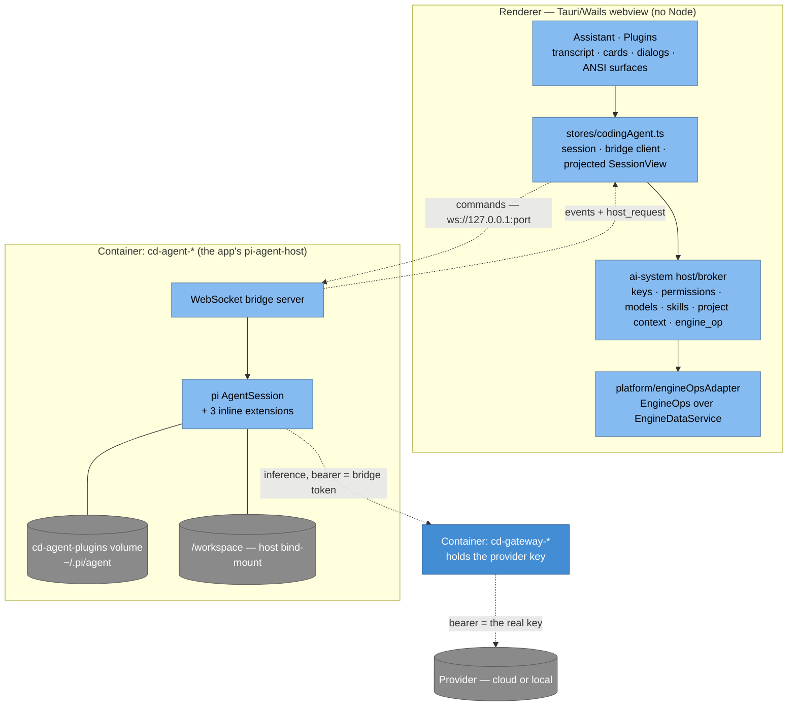

# AI subsystem

Container Desktop is a **GUI for a [pi](https://github.com/earendil-works/pi) coding agent**. pi is consumed as
a library, its terminal UI is replaced by the app's React UI, and the agent itself runs **inside a container on
one of your engine connections** — not in the webview, not in a host sidecar.

Three worlds, two of them containers:

| World | What runs there | Trust |
| ----- | --------------- | ----- |
| **Renderer** (webview) | the transcript, cards, dialogs, ANSI surfaces, the composer; the AI broker; the engine ports | explicitly trusted — there is no process boundary inside it |
| **Agent container** (`cd-agent-<id>`) | the pi session, its plugins and their code, the app's `pi-agent-host` entry | untrusted enough that the provider key never enters it |
| **Gateway container** (`cd-gateway-<id>`) | an authenticating reverse proxy that holds the provider key | holds the credential; plugin code cannot reach it |
| **Login container** (`cd-login-<id>`) | one provider sign-in — pi's own OAuth flow, which needs a Node realm | one-shot, mounts nothing, removed on every path out |

The agent's own file tools see the container's filesystem. The **workspace toolset** (`readFile`, `listDirectory`,
`statPath`, `findFiles`, `searchText`, `writeFile`, `editFile`, `removePath`, `execCommand`) is the app's, and it acts
on the `ExecutionTarget` the session chose — a `container` it already runs, or a disposable `sandbox`
([Execution targets are containers](#what-the-broker-still-owns)). It is registered with pi ONLY
when a target was chosen (`CD_WORKSPACE_TOOLS`), because a registered tool is a promise the operation can happen; the
container is told THAT it exists and never where it lands. Calls arrive as `workspace_op`, the broker resolves one
`ExecutionSelector` per run (so a session shares one backend and one sandbox) and `dispatchWorkspaceOp` calls the
`IWorkspaceAccess` capability, which enforces workspace-root confinement inside its own implementation. Mutations are
gated at that boundary — the only one that can hold the request and run it on approval — which is why the pre-call
`tool_call` gate skips every tool the app performs. `workspaceRelease` disposes the run's targets when the session
stops; a sandbox exists for the run and nothing else.

**The built-in knowledge** (`src/resources/prompts/knowledge-bank.md`) is curated symptom / solution / commands entries
for real podman, docker, WSL and SSH failures. It is offered as `searchKnowledge` and answered INSIDE the agent
container — the entries ship in the image, so the tool asks the app for nothing. Searched rather than prompted: the
whole bank is context every unrelated turn would pay for and never read, while a tool costs nothing until the model
asks. `core/knowledgeBank.ts` parses and ranks (symptom first, then title, then the curator's id and tags), capped per
search so a vague query cannot return the whole bank. Ungated — it reads shipped data and touches nothing.

Tool execution is **consent, not a sandbox** — but the blast radius is a disposable container with one host
folder bind-mounted, which is why the permission policy here is looser than the app's host-side floor
(see [The permission model](#the-permission-model)). Once data reaches the configured provider the app cannot
contain it; the provider is the user's choice and the allow/reject record is the auditable half.

## Shape

```mermaid
flowchart TB
  subgraph renderer["Renderer — Tauri/Wails webview (no Node)"]
    ui["Assistant · Plugins<br/>transcript · cards · dialogs · ANSI surfaces"]:::component
    store["stores/codingAgent.ts<br/>session · bridge client · projected SessionView"]:::component
    broker["ai-system host/broker<br/>keys · permissions · models · skills · project context · engine_op"]:::component
    ops["platform/engineOpsAdapter<br/>EngineOps over EngineDataService"]:::component
  end
  subgraph agent["Container: cd-agent-* (the app's pi-agent-host)"]
    host["WebSocket bridge server"]:::component
    pi["pi AgentSession<br/>+ 3 inline extensions"]:::component
    vol[("cd-agent-plugins volume<br/>~/.pi/agent")]:::external
    ws[("/workspace — host bind-mount")]:::external
  end
  gw["Container: cd-gateway-*<br/>holds the provider key"]:::container
  prov[(Provider — cloud or local)]:::external

  ui --> store
  store -.->|"commands — ws://127.0.0.1:port"| host
  host -.->|"events + host_request"| store
  host --> pi
  pi --- vol
  pi --- ws
  store --> broker --> ops
  pi -.->|"inference, bearer = bridge token"| gw
  gw -.->|"bearer = the real key"| prov

  classDef component fill:#85bbf0,color:#000,stroke:#5d82a8;
  classDef container fill:#438dd5,color:#fff,stroke:#2e6295;
  classDef external fill:#8a8a8a,color:#fff,stroke:#5e5e5e;
```

**Why a WebSocket.** pi's client layer is transport-neutral and node-free, and a webview speaks WebSocket on
WebKitGTK and WebView2 alike. The agent listens on a loopback-published port with a per-session bearer token,
so the app only performs operations it already has: build, run with `-p 127.0.0.1:<port>`, mount, rm. The
alternative — framed JSONL over `exec -i` — would need bidirectional streaming stdio into a container on every
shell, which the host contract does not expose. pi's own experimental `pi-server` wire format is not adopted:
it carries no extension UI, and extension UI plus render frames is most of what this bridge is for.

## Packages and layering

| Package | Runs in | Contains |
| ------- | ------- | -------- |
| **`@/pi-bridge`** | both | the wire contract only — `protocol.ts` (version 1, commands, events, host methods), `codec.ts`, `image.ts` (`agentImageTag`). No Node, no DOM, so both ends import the same types |
| **`@/pi-agent-host`** | the container (Node 24) | the bridge server, the pi session and its three inline extensions, the virtual terminal + surface registry, the plugin service, the gateway. **Excluded from the renderer graph** — bundled separately by esbuild into the image |
| **`@/ai-system`** | the renderer | `core/` (pure protocol + policy) → `adapters/` (impure infra) → `host/` (the broker), plus `ui/core/` (framework-free view logic) and `testing/` |

`@/ai-system/core/` stays dependency-free: no `@/platform`, `@/i18n`, `@/web-app`, `react`, `node:*`,
`@tauri`/`@wailsio`, and no sibling layer. **The agent engine is not in this package** — it is the pi bridge,
which is what keeps any agent library out of `core`'s graph. There are **no barrels or pass-through
re-exports** anywhere; every type has one origin. This is a review rule, not a Vitest test.

## The bridge protocol

One version constant (`PI_BRIDGE_PROTOCOL_VERSION = 1`) and three directions.

**Renderer → container** (`BridgeCommand`): `hello` (token + version), `prompt` (with pi's `steer` /
`followUp` streaming behavior), `abort`, `host_response`, `surface_input` / `surface_resize`, `set_theme`,
the plugin verbs (`plugins_list` / `_install` / `_remove` / `_update` / `_check_updates` / `_set_enabled`),
`resources_list`, `session_reload`, and `read_tool_output` (below).

**Container → renderer** (`BridgeEvent`): `ready`, `response` (settles a command), the turn stream
(`assistant_delta` / `assistant_end` / `tool_start` / `tool_update` / `tool_end` / `turn_end` / `idle` /
`error`), plugin data (`entry` from `appendEntry`, `custom_message` from `sendMessage`), rendering
(`surface_frame` / `surface_closed`), plugin management (`plugin_progress`, `plugins_changed`), and
`host_request`.

**Container → renderer → container** (`host_request` / `host_response`): the reverse call. Its `method` is one
of nine extension-UI members (`select` · `confirm` · `input` · `editor` · `notify` · `setStatus` ·
`setWidget` · `setTitle` · `setEditorText`) plus **`approval`** (the permission gate) and **`engine_op`** (one
container operation). `hostRpc` **resolves to a fallback rather than rejecting**, so silence arrives as an
explicit refusal instead of a hung agent.

`classifyHostRequest` (`core/uiRequests.ts`) is the pure routing table: dialog · approval · engine-op · chrome
· ignored. An unknown method degrades to *ignored*, so a plugin written against a newer host cannot crash the
renderer.

**Reading a truncated output.** pi caps a noisy command's output and writes the whole thing to a file *inside
the container*, naming it in the tool result's `details.fullOutputPath` — a path the card cannot open.
`read_tool_output` is that read. The path arrives from a tool result, which a plugin can author, so
`toolOutput.ts` checks it against the exact shape pi's own bash executor produces
(`<tmpdir>/pi-bash-<id>.log`, flat, no traversal) and refuses anything else rather than opening it. The read
returns the **tail**, capped at 2 MiB: a truncated command's interesting part is where it stopped.

## Starting a session

`useCodingAgentStore.start()` (`web-app/stores/codingAgent.ts`) drives `startPiAgentSession`
(`adapters/piAgentContainer.ts`) against the connection's `HostClientFacade`:

1. create a session-scoped network (`cd-agent-net-<id>`; a pre-existing one is not an error);
2. write the **gateway** env file — upstream base URL, **the provider key**, the bridge token — and run
   `<image> --mode gateway` on that network. The renderer never handles that key: it composes the file with
   `KEYCHAIN_SECRET_PLACEHOLDER` and the realm owning the vault substitutes it while writing (below);
3. write the **agent** env file — deliberately *without* the key: bridge token and port, the gateway URL, the
   model id, `/workspace`, the agent dir — and run `<image> --mode agent` with
   `--publish 127.0.0.1:<port>:8787`, the workspace bind-mount, and the plugin volume;
4. connect the WebSocket client and publish the app's theme palette **before** the first plugin frame, so no
   component paints in pi's colours and then flashes to the app's.

Env files are written privately under `~/.local/share/container-desktop/agent/`, never passed in argv.
A **scoped** engine (WSL, Lima, a podman machine) runs every command through the scope wrapper, and the
workspace path is translated with `resolveGuestPath` before it is mounted.

**User mapping.** Rootless podman maps the invoking user to container root, so the image's `agent` user
(uid 1001) needs `--userns keep-id:uid=1001,gid=1001` or the bind-mounted workspace is effectively read-only;
Docker gets no mapping. The plugin volume mount adds podman's `:U` under keep-id, without which a volume
created under an earlier mapping stays owned by the old uid and pi fails with EACCES on the *first turn*,
not at startup.

**Ports.** `pickHostPort()` is `41000 + random(4000)` with no retry — probing from the renderer was judged
worse. A collision surfaces as `failed to bind host port … address already in use` in the start log.

**Egress** is on by default (a coding agent needs package managers). `egress: false` creates the agent's network
`--internal` — an internal bridge has no gateway address, so nothing on it reaches the internet or this machine —
and attaches the gateway to a second `…-egress` network so inference still works. The agent keeps its published
bridge port either way; both networks are removed on stop.

## The agent container

`pi-agent-host/src/main.ts` starts a `WebSocketServer` on `0.0.0.0:8787` and builds one pi session per connection,
queueing frames that arrive while it is still starting. `createPiSession` (`session.ts`) assembles pi's
`createAgentSessionServices` with **three inline extensions**:

- **the gateway provider** — `registerProvider("container-desktop-gateway", { baseUrl: <gateway>, apiKey:
  <bridge token>, api: <the upstream's wire shape>, models: [<the one model>] })`, where the shape comes from
  `CD_MODEL_API` (`openai-completions`, or `anthropic-messages` for an Anthropic upstream). pi therefore never reads
  `~/.pi/auth.json` and never learns a real key. Registration is queued by the extension runtime and flushed
  by `createAgentSessionServices`, which is why services are built here rather than calling the low-level
  `createAgentSession`;
- **the permission gate** — `pi.on("tool_call", …)` asks the app for a verdict on **every** tool call and
  blocks on the answer. An unreachable app is not consent: it fails closed with the reason;
- **the container toolset** — 21 tools that call back over `engine_op`.

Settings and packages are file-backed at the mounted agent dir, so `pi install` survives a session and an
image rebuild. `projectTrusted` starts **false** and follows the user's own trust decision — pi's own default is to
TRUST the project, which would let a project nobody vouched for have packages written into the user's workspace. The
decision lives in the agent dir (`ProjectTrustStore`, so nothing is written into the project to record it) and reaches
pi through `setProjectTrusted` at construction and on every `/trust` write. The install drawer offers the project
scope only while that answer is yes, and says why when it is not. **pi owns session persistence** (its own JSONL entry tree); the GUI
transcript is a projection of the event stream, which is why the app has no session store of its own on this
path.

`initTheme()` is called for a narrow reason: pi's own components read a module-global theme that *throws*
until initialised, so a plugin building a `Markdown` or `SelectList` would crash on first render. The app's own
palette then **replaces** it: pi exposes that global as a Proxy over `Symbol.for` registry keys — a deliberate
handshake so its module loaded through tsx and through jiti share one theme — so `installGlobalPiTheme` writes both
keys pi's own writer does, at session start and on every `set_theme`. A plugin's un-themed `Markdown` therefore
paints in the same colours as everything else the app hands it. If pi ever renames those keys, its components fall
back to pi's built-in theme, which is where they were before, and nothing throws.

**The gateway** (`gateway.ts`) is the same image with `--mode gateway`. It authorizes on
`Authorization: Bearer <bridge token>`, strips the caller's credentials and every hop-by-hop header, substitutes
the real key, and forwards. Response `content-encoding`/`content-length`/`transfer-encoding` are dropped —
`fetch` already decoded the body, so echoing them makes the client try to gunzip plain text. An upstream
failure answers **502 without echoing the error**, which would contain the signed request headers.

This is a practical reading of "keys never enter the container": the key lives in *a* container, just not one
plugin code can reach — no shared filesystem, no exec, no env. Host-local models keep working because the
gateway can forward to `host.containers.internal`.

## Container tools and `engine_op`

pi runs in a container and cannot reach the engine ports, so the app's container toolset is registered
*inside* pi as thin callers and executed *by the app*.

- **In the container** — `containerToolCatalogue.ts` declares one descriptor per operation with its TypeBox
  parameter schema; `containerTools.ts` registers them and turns each call into one `engine_op` request
  (10-minute timeout, so a mutation can wait on a human). Model-facing prose lives in
  `src/resources/prompts/agent-tool-descriptions.md` and is injected, not imported, keeping markdown out of the
  unit-test graph. The tool names are **the app's own** container tool names, so a container tool arrives in the
  GUI already understood by the cards, the titles and the permission gating.
- **In the app** — `core/engineOpDispatch.ts` validates the name against `CONTAINER_TOOL_NAMES` (never
  reflected off the port, so `constructor` and friends are undispatchable), fills in the session's connection
  when the model omitted one, and calls the `EngineOps` port. `listConnections` is deliberately unscoped —
  its whole purpose is telling the model which *other* connections exist. It **never throws**: a blocked agent
  is waiting on this answer, so a failure is a value the model can act on.

`EngineOps` is implemented by `platform/src/engineOpsAdapter.ts` over the live `EngineDataService` — the same
host clients the rest of the app uses.

The 21 operations: `listConnections`; list + inspect for containers, images, networks and volumes;
`getContainerLogs`, `getContainerStats`; and the gated mutations `startContainer` / `stopContainer` /
`restartContainer` / `pauseContainer` / `unpauseContainer` / `removeContainer`, `removeImage`, `removeNetwork`,
`removeVolume`, `pullImage`.

## The permission model

One decision function for both boundaries, and a global mode the user picks
(`AISettings.permissionMode`, default **always ask**):

| Mode | Behaviour |
| ---- | --------- |
| **`ask`** — always ask | every gated call raises a card; the record is neither read nor written |
| **`remember`** — ask and remember | a card only if not already decided; a remembered allow runs silently, a remembered block is rejected **visibly**, and a fresh decision is persisted |
| **`allow`** — always allow | no prompt, no record (an explicit max-trust opt-in) |

`decidePiToolCall` (`core/piApprovals.ts`) classifies the tool, then defers to the same `resolveToolAction`
the rest of the app uses. pi's read-only built-ins (`read`, `grep`, `find`, `ls`) run unattended; everything
else — the mutating built-ins, plugin tools, MCP tools — is gated, so a tool nobody has classified is *asked*
about rather than run. The container tools take their read/mutation split from `TOOL_CATALOGUE`
(`core/toolCatalogue.ts`), so a tool re-gated in one place cannot stay ungated in the other.

**Two boundaries, one card.** pi asks for a verdict on *every* tool call, so a container mutation arrives
twice: once as the pre-call `approval`, once as the `engine_op` the app performs itself. Only the second can
hold the request and run it, so the **pre-call gate defers for container tools** (`boundary: "tool-call"`
returns `run`) and the `engine-op` boundary decides. Gating at the pre-call boundary instead would also be
unsound: any extension can call `engine_op` without registering a tool at all.

**The floor is deliberately not applied here.** `commandFloor.ts` assumes an args *array* and treats a shell
metacharacter as injection intent — but pi's `bash` takes a shell string, where a pipe is the tool working as
designed. Its program denylist is about blast radius on a real machine, and this agent is a disposable
container with one folder mounted: the same reasoning the floor's own `sandbox` scope already encodes.

**A rejection stops the agent.** Answering "no" and nothing else makes the model retry the same command
immediately — measured against a real model, one "no" became an approval card per second. `resolveApproval`
therefore also calls `client.abort()`, so one "no" means stop and the user can steer.

**What a card says.** `piApprovalSummary` shows the shell command, the path, or — for a container mutation —
the entity **and the connection it lands on**, filling in the session's connection when the model omitted it.
Only the *text* resolves: the call's `args` stay exactly as the agent sent them, because they are also the
identity a remembered decision is keyed on.

**The record.** Remembered decisions live in the version-2 `userData/ai-permissions.json`, owned by the broker
(private temp-file + atomic rename; a block beats an allow; a corrupt or wrong-version file fails closed to
"nothing remembered", which means asking). `piPermissionContext` scopes every pi rule to the **workspace
path** and the **engine connection** — never the per-session container names, which carry a random suffix —
under the subject `pi-coding-agent`. Managed from **Settings → AI permissions**.

## Extension UI — three tiers

The agent host binds its own `ExtensionUIContext` and reports **`mode: "tui"`**, which obliges real component
rendering; claiming it before T3 existed would have made plugins take a rich path the GUI could not serve.

**T1 — dialogs and chrome to native.** `select` / `confirm` / `input` / `editor` become blocking
request/response pairs that preserve pi's timeout and dismissal semantics; `confirm` renders as `ConfirmMenu`,
per the app's UI conventions, never a dialog. `notify` becomes a toast, `setStatus` a footer strip, `setWidget`
a strip above or below the composer, `setTitle` the session title, `setEditorText` a composer draft delivered
as `{ text, seq }` so the same text set twice still applies twice. One pending dialog at a time — pi's dialogs
are modal by nature, and the agent is parked until answered.

pi's three working-indicator calls (`setWorkingMessage` / `setWorkingVisible` / `setWorkingIndicator`) arrive as one
`setWorking` and land on the indicator the app already shows while a turn streams: the message replaces the app's own
cycling word, and visibility is honoured — including pi's documented `frames: []` for "hide it entirely". Custom
animation **frames are not adopted**: the GUI animates its own spinner, and a plugin's glyphs would read as foreign
beside it. Message and visibility are separate calls in pi, so each leaves the other alone.
`setHiddenThinkingLabel` is the one member still doing nothing, deliberately — there is no collapsed-thinking row in
this UI to label, and inventing one is a visual change with no agreed design.

**T2 — structured data to native cards.** A tool result is rendered by a typed card, not raw JSON
(`web-app/components/ai/cards/registry.tsx`):

| Source | Card |
| ------ | ---- |
| container reads | `ContainersCard` · `ImagesCard` · `NetworksCard` · `VolumesCard` · `LogViewerCard` |
| container mutations | `ActionResultCard` |
| pi's built-ins | `bash` → `ExecCard`, `read`/`write` → `FileCard`, `edit` → `DiffCard`, `ls` → `ListingCard`, `grep`/`find` → `SearchCard` |
| anything else | a redacted-JSON fallback, with the plugin's own T3 surface as the card body |

pi's built-ins return their payload as **text**; their `details` carry only truncation flags. `core/piToolCards.ts`
is the single place that knows those text formats and rebuilds a card result from `(args, text, details)`.
`edit` is the one rich exception (`diff` / `patch` / `firstChangedLine`) and therefore the only diff source;
`bash` reports **no exit code** — a non-zero exit throws and arrives as an error ending "Command exited with
code N".

**T3 — components to ANSI surfaces.** A `VirtualTerminal` implements pi's `Terminal` interface, `GuiTui extends
TUI` and overrides `requestRender` so a component asking to repaint re-renders its own surface, and the surface
registry emits whole-render `surface_frame` events. The renderer paints them into xterm instances
(`components/ai/AnsiSurface.tsx`, `PluginSurfaces.tsx`), keyed by slot: per-tool call/result rows,
`ctx.ui.custom()` focus surfaces (overlay placement honoured as a floating panel), footer, header, composer
replacement, and widgets. Every slot is single-occupancy, so a plugin re-setting its footer never stacks two.
A pi theme is derived from the app's `--app-*` tokens (`web-app/themes/appPiTheme.ts` → `piTheme.ts`) and
re-published whenever engine or light/dark mode changes them.

## Plugin management

The **Plugins** screen is a face on pi's own package manager: the container resolves and installs, the screen
shows what it reports. `plugins_install` / `_remove` / `_update` / `_check_updates` / `_set_enabled` map onto a
`DefaultPackageManager` over the same settings and agent dir, with its progress callback streamed as
`plugin_progress` so an npm or git wait is legible. A change emits payload-free `plugins_changed` — the GUI
refetches rather than patching a row and drifting from what pi actually has. `resources_list` reports what the
loaded packages contribute (extensions, commands, skills, prompts), which is what fills the composer's
slash-command palette. `core/pluginCatalog.ts` turns pi's `ConfiguredPackage` entries into table rows;
`web-app/stores/pluginStore.ts` holds them.

Only **user** scope is offered. Project scope is moot while nothing in the UI chooses a workspace.

## What the broker still owns

`createAISystem` (`host/createAISystem.ts`) resolves the user-data JSON store paths, builds the file-backed
stores, and registers one `AIBroker` over the shell's transport. Every `ai:*` handler is sender-guarded, its
request validated against the Zod schema in `core/schemas.ts`, and its response validated again by
`host/aiClientBridge.ts` — one client bridge, reused by both shells over an in-realm bus.

| Group | Channels | State |
| ----- | -------- | ----- |
| status / diagnostics | `ai:status`, `ai:diagnostics` | live |
| provider keys | `ai:key:{has,set,clear}` | live |
| the agent pair's private env files | `ai:agent:{gateway-env,env-file}` | live — the key is substituted natively, never in this realm |
| model discovery | `ai:models:{list,cancel}` | live |
| one model's facts | `ai:model:window` | live — the provider probe ([below](#what-the-app-knows-about-a-model)) |
| web search, run for the agent | `ai:web:search` | live — refused while the user's own switch is off |
| the permission record | `ai:permissions:{list,add,remove}` | live |
| container operations | `ai:engine:op` | live — the agent's `engine_op` lands here |
| skills | `ai:skills:*` | live |
| project context | `ai:project-context:*` | live |
| workspace changes | `ai:changes:{status,diff}` | live |

**Invoking a skill spans both worlds.** `ai:skills:invoke` **resolves and renders**, it does not submit: the
host does the fingerprint match, the project-trust check, the prompt render and the size cap, then answers with
`{ prompt, displayContent, skill, allowedTools?, initialTaint? }`. The renderer submits that through
`useCodingAgentStore.submitSkill`, which shows the command in the transcript, sends the body to the model, and
holds the skill's narrowing for the turn: a tool outside `allowedTools` is refused with a reason (the model can
adapt — this is a declared narrowing, not a user's "no", so it does not abort the turn), and `initialTaint`
suppresses remembered allows so the user sees what an unvouched-for skill asked for. The narrowing lifts on
`turn_end`.

**Execution targets are containers.** A target is a container — one already running, or a disposable sandbox created
for the session — and the **connection is how it is reached**, never a target of its own: connections are this app's
core principle, so a local engine, a machine VM, WSL and an SSH host are all the same choice made once at the top of
the start form. `core/schemas.ts` is the single origin of the two-member union;
`platform/src/capabilities/{connectionExec,execWorkspaceAccess,executionSelector}.ts` implement both backends and are
injected into the broker, and the mock-only `__aiSandboxExecProbe` seam is what
`webdriver/specs/sandbox-exec.e2e.js` drives. The start form asks for the reference through
`screens/AI/ExecutionTargetSelect.tsx`, a Suggest over the CHOSEN connection's running containers (or its pulled
images for a sandbox) that still accepts a name the list has not seen — a container can be started between filling
the form in and starting the session.

Where a change SET was read is a different question, and has its own type: `WorkspaceChangeOrigin` is `app` (the
folder as this app sees it, which is what the app's own git status reads) or one of the two container targets.

## Providers

`resolveProvider` (pure, `core/providers.ts`) decides id/kind/baseURL/model/requiresKey/discovery. The catalog
(`resources/ai/provider-catalog.json`) ships **eight**:

- **Local, no key** — LM Studio, llama.cpp (loopback base URLs).
- **Cloud, needs a key** — Anthropic, OpenAI, DeepSeek, GLM (Zhipu), MiniMax, and OpenRouter (an aggregator;
  aggregated model ids split by `parseAggregatedModelId`).

**Inference** runs entirely on pi's own provider layer: the renderer hands `start()` an endpoint, a model id and
the provider it came from, and everything after that is the gateway — there is no AI-SDK dependency left in the
app. Two things travel with the provider, both derived from its catalog kind in `core/piAgentEnv.ts`: the **wire
shape** pi speaks (`CD_MODEL_API`, plus the gateway base URL that shape's client expects — the Anthropic SDK
builds its own `/v1`) and the **credential shape** the gateway signs (`CD_UPSTREAM_KIND` /
`CD_UPSTREAM_AUTH_SCHEME` / `…_HEADER_NAME` / `…_USERNAME`, mirroring `providerTransport`'s
`authenticatedHeaders`: Anthropic is `x-api-key`, a keyless local server is nothing at all).
**Discovery** is live and provider-specific: `adapters/localModels.ts` `listModels` paginates
OpenAI-compatible endpoints with `after`, uses Anthropic's `anthropic-version` + `after_id`, falls back to an
explicitly saved model for a single-model server, and performs no request at all for a manual provider. The
renderer cache is TanStack Query, keyed by provider id + normalized endpoint + auth metadata + a non-secret
credential revision.

**Signing in instead of pasting.** A provider pi carries a login flow for is offered pi's own label
("Sign in with OpenRouter") beside the credential actions in Settings → AI. pi loads each flow through a
bundler-opaque specifier so its `node:http` callback server and `node:crypto` PKCE never reach a bundle, so the
flow cannot run in the web view at all: it runs in a **one-shot login container** (`cd-login-<id>`, `--mode login`),
which mounts nothing, joins no session network and publishes only its bridge to loopback. `AuthInteraction` travels
as its own frames — `auth_prompt`, `auth_prompt_closed`, `auth_event` — and the browser completes the sign-in, so
the paste prompt pi races its callback against is what finishes it here (a callback server inside a container is a
browser on another machine, which is the case pi designed that prompt for).

**Every flow pi ships is offered**, under pi's own words — the selector label where a flow declares one, otherwise
pi's name for the auth method ("Anthropic (Claude Pro/Max)"). There is no list of who can be signed into:
`providerLoginOffer` reads pi's catalogue, and `loginCredentialVerdict` judges what came back. OpenRouter's flow ends
in a permanent user-controlled key, stored as itself; anthropic, openai-codex, github-copilot, kimi-coding, xai and
radius end in an access token with a refresh token beside it, stored WHOLE as a one-line tagged envelope
(`pi-bridge/providerCredential.ts`) in the same vault slot — a key already in a keychain does not change meaning, and
the gateway reads the access token out of whichever it is handed. The one shape still refused is a token that expires
with nothing to renew it.

**Renewing a sign-in.** The exchange runs pi's own `OAuthAuth.refresh` in the same one-shot container a sign-in runs
in (`auth_refresh`), for two reasons: the flow code cannot load in a web view, and the credential cannot either —
`getKey` refuses in that realm by design, so the container reads it from `CD_CREDENTIAL`, substituted into a private
env file by the realm that owns the vault (`ai:auth:refresh-env` → `keyStore.writeSecretFile`). The container answers
with the rotation, or `unchanged` plus the expiry it read, and the app stores a rotation exactly the way it stores a
sign-in. A session renews **before** its gateway env file freezes the access token, and again on a timer before the
stored expiry; the renewed token reaches a RUNNING gateway through the agent container
(`gateway_credential` → `POST /__cd/credential`), because the gateway sits on the pair's `--internal` network with no
published port and the agent is the only thing that can reach it. A spent refresh token is reported as "sign in
again" rather than surfacing as a 401 mid-turn.

Keys never live in `user-settings.json`. They are keychain-backed per shell, and the two shells differ in a way
that is a real security difference:

| Shell | Provider transport | Where the key is resolved |
| ----- | ------------------ | ------------------------- |
| **Tauri** | native, in Rust ([`provider_transport.rs`](../../src-tauri/src/provider_transport.rs)) | in Rust — the plaintext key never enters the JavaScript realm |
| **Wails** | the webview's `fetch` ([`fetchProviderTransport.ts`](../../src/packages/platform/src/providerTransport/fetchProviderTransport.ts)) | in the webview realm, so it depends on provider CORS and streaming |

Both send the key onward to the gateway container when a session starts, so the difference is about the
discovery/diagnostics path, not the session.

**The credential never crosses into the web view — not even to reach the container.** Tauri's keychain
deliberately refuses `getKey` there, which is why the gateway env file is not written by the renderer at all:

- the host composes it with `KEYCHAIN_SECRET_PLACEHOLDER` in place of the key (`core/piAgentEnv.ts`, the one
  composer and one file format), and calls `keyStore.writeSecretFile(provider, fileName, contents)`;
- the native side (`keychain_write_secret_file` in Rust, `KeychainService.WriteSecretFile` in Go) reads the
  secret, substitutes it, writes **0600** into `<userData>/agent/`, and answers only the path. The caller names
  a FILE, never a directory, and a body without the placeholder is refused rather than written unauthenticated;
- every web-view-reachable read of that directory is refused (`host/fs.rs`, `fs_service.go`) — including a
  `rename` that would carry the file out of it. Without that, "the key never enters this realm" would be one
  `fs_read_text_file` away.

`webdriver/smoke/agent-secret-file.smoke.js` proves all three against a real app.

`redactPayload` / `redactText` strip provider-key prefixes, bearer tokens, JWTs, URL credentials and
secret-looking env assignments from what is displayed and stored. Web search, when a shell can pin a
destination, is SSRF-guarded (reserved/private/loopback/link-local IPs blocked, redirects re-checked, the fetch
restricted to its fixed origin).

## What the app knows about a model

**Only the app can ask.** The gateway forwards the completions API and nothing else, so LM Studio's
`/api/v0/models` and llama.cpp's `/props` are unreachable from inside the container — and the OpenAI-shaped
`/models` listing every provider serves carries an id and nothing more. A number a server would reject is worse
than no number, so a fact nobody published stays absent and the panels say "unknown".

**One model, on demand.** `ai:model:window` → `fetchModelWindow` (`adapters/modelWindow.ts`) asks about the model
in use, and only a provider with a documented endpoint is asked:

| Provider | Endpoint | What it yields |
| -------- | -------- | -------------- |
| LM Studio | `/api/v0/models` | `loaded_context_length` — what the running instance will accept, commonly a fraction of the model's own `max_context_length`, which stands in when nothing is loaded |
| llama.cpp | `/props` | `default_generation_settings.n_ctx`, not the top level; the model id plays no part, since it serves one model at the `-c` it was started with |
| OpenRouter | `/api/v1/models` | the window, `top_provider.max_completion_tokens`, the prices, and the reasoning capability |

A probe answers with what it learned **or with nothing at all** — an empty object would read as "asked and
answered". Prices are converted to **dollars per million tokens**, the unit pi's catalogue prices in (it divides by
1e6 before billing a turn), so passing a per-token rate straight through would under-report a bill by a factor of a
million.

**Under the probe sits pi's own catalogue** (`pi-bridge/modelBaseline.ts`), so a provider with no endpoint to ask is
no longer a blank: pi ships generated per-model data — window, completion cap, rates, `reasoning` and
`thinkingLevelMap` — for Anthropic, OpenAI, DeepSeek and GLM (our `glm` is pi's `zai`, whose catalogue carries the
same ids). A model pi never published finds no baseline and falls back to what it always did, which makes a wrong
mapping answer nothing rather than wrongly. Deliberately absent: LM Studio and llama.cpp, which pi does not carry,
and OpenRouter, whose own listing is live where a generated snapshot could only be staler.

**Only the FACTS come from it.** pi's minimax entry speaks `anthropic-messages` while our own minimax provider is
OpenAI-shaped, so `api`, `baseUrl` and `compat` are never inherited — the wire is the upstream's and
`piUpstreamCompat`'s business. A window, a price and a reasoning capability are properties of the MODEL, which is why
they carry across a different endpoint serving it.

**An AGGREGATOR never gets a baseline.** Its terms are per route — the same model is served at different windows,
caps and prices, and several are free where the vendor charges — and its own listing publishes all of it live, so a
snapshot underneath could only contradict it. Detected the way pi's ids show it: an aggregator's carry a vendor
prefix. Its catalogue is still LISTED, because browsing it offline is useful; it just never becomes a floor.

## Where the picker's sources come from

`ui/core/providerSources` puts the two lists together. `provider-catalog.json` owns what the app can CONNECT to —
endpoint, auth schemes, whether discovery is a listing or a single served model — and it owns LM Studio and llama.cpp,
which pi has never heard of. pi's catalogue owns BREADTH: **37 providers**, names and per-model data included, none of
it written down here (`piProviderCatalogue` reads `builtinProviders()`, so the list cannot drift from pi's).

The root panel keeps the app's own **Local** and **Cloud** groups first, in their existing order, and adds one group
below for everything pi ships that the app has no entry for; each of those rows says how many models pi publishes.
Drilling into one lists them **with no key, no network and no settings entry** — a generated catalogue asks nobody —
above a strip explaining that browsing is free and a key is what using one needs. Nothing there wears a tick: the
tree resolves a choice, which is right when picking and wrong when browsing.

**Adopting** one writes the connection facts pi already published (its endpoint, and that it takes a bearer token)
into `ai.providers`, which is what makes it a source a session can start on. It then appears among the Cloud sources
on both surfaces — the picker and Settings — because a provider whose key can never be edited is a dead end. The KEY
itself is never touched by that write. A pi-only provider resolves through `sourceCatalogEntry`, so the panels, the
tree builder and the settings form all see the same `ProviderCatalogEntry` shape they always have; its `kind`,
`discovery` and aggregator flag are read off the api its models declare and whether their ids carry a slash.

**Whether a model reasons has four sources and one route.** OpenRouter publishes it twice over — the word
`reasoning` in `supported_parameters`, and a `reasoning` entry of its own carrying `supported_efforts` and
`mandatory`; a model that does not reason carries neither, which is what tells the two apart. pi's catalogue
publishes it per model for the providers it covers, levels included, which is why a Claude session has a thinking
level at all and why `o3-mini` offers low/medium/high and no `off` rather than pi's whole vocabulary. For a model pi
has never heard of under a provider serving an id-only listing, `provider-catalog.json`'s `reasoning.modelPrefixes`
is the answer and costs no request at all: the catalogue declares **which** models think, never how hard, so it
never displaces published levels — a bare capability over `{levels, mandatory}` would lose the detail pi had.
Everything else publishes nothing and keeps pi's `false` — LM Studio's `capabilities` never mentions reasoning, and
guessing from an id or an `arch` would be fiction.

**The facts travel two ways, both as a `PiModelRegistration`.** The model a container is born on is registered
before anything has dialled the bridge, so its facts go in the agent's env file (`CD_MODEL_CONTEXT_WINDOW`,
`…_MAX_OUTPUT_TOKENS`, `…_COST_*`, `CD_MODEL_REASONING` + `…_LEVELS` / `…_MANDATORY`), each var **omitted when
unknown** so the container can tell unknown from zero, and the flag alone is the capability. Every later pick
arrives as a `model_select` command. `withModelRegistration` merges rather than replaces: the set grows by USE —
nothing pre-registers a provider's catalogue, because the picker is a drill-down precisely so a catalogue is read
one level at a time — a model keeps its position so the list does not reshuffle under the user, and what the app
once learned survives a switch back that carried only an id.

**`piModelConfig` turns that into pi's own vocabulary.** Presence of the facts is pi's `reasoning`; the levels
become a `thinkingLevelMap`, because pi resolves availability FROM the map and not from a list — a level mapped to
`null` is withdrawn, `xhigh` and `max` are offered ONLY when named, and `mandatory` withdraws `off`, which is how a
model that always reasons stops offering a mode it has not got. A provider that published no efforts leaves pi's own
set standing rather than a narrower invented one. pi's `ProviderModelConfig` requires both numbers, so
`PI_FALLBACK_CONTEXT_WINDOW` / `PI_FALLBACK_MAX_OUTPUT_TOKENS` (128000 / 4096, shared by both sides because both
must agree on the cap in force) stand in — and are never reported to the user as a model's budget. With the baseline
underneath, they are now reached only for a model neither pi nor a probe could answer about.

**What the user is offered comes back from pi**, not from the app's own list: `availableThinkingLevels`
(`sessionControls.ts`) is `getAvailableThinkingLevels()` when the session `supportsThinking()` and empty otherwise,
so the settings drawer hides the control instead of offering a level the provider would ignore. The level is written
through `/settings thinkingLevel <level>`, which refuses one that is not in that same answer — writing a level the
model cannot reach would show the change in the drawer and be silently clamped on the next turn.

**A pick that cannot fit the session warns, and does not refuse.** `undersizedWindow` (`core/piContextReport.ts`)
adds the session's own reported prompt — system context plus tool definitions — to the answer room that model will
reserve, and compares the total with the published window. It is an estimate at four characters per token, so
refusing on it could lock the user out of a model that would have worked; both numbers go in the toast's **message**,
which is the half the user sees (`detail` reaches only the Notification Center). It is measured before the switch and
shown after it, naming the model the session now has. A session's very FIRST pick cannot be warned about at all —
nothing has reported a prompt yet, and inventing a number to compare would be the fiction this avoids.

**The gateway hides the upstream from pi, so the app names it.** pi decides the wire dialect per model from
`model.provider` and `model.baseUrl` (`detectCompat`) — ours are `container-desktop-gateway` and a container-internal
URL, so **every** upstream reads to pi as plain OpenAI: the system prompt goes as role `developer`, `store: false` is
sent, `max_completion_tokens` is used where the server wants `max_tokens`, and a thinking level travels as
`reasoning_effort` where the server wants an object of its own. The developer role and the thinking shape are both
gated on `model.reasoning`, so none of it bit until a model reasoned.

`piUpstreamCompat` (`pi-bridge/upstreamCompat.ts`) answers what the real upstream wants, and the registration carries
it as pi's own `compat` — the slot pi merges **field by field** over its own detection, so naming only what differs
leaves every other rule pi's. It is matched on the upstream's **base URL**, the same input pi would have used, so a
custom endpoint pointed at one of these hosts is read exactly as the catalogue entry is; the URL reaches the agent as
`CD_UPSTREAM_BASE_URL`, which is catalogue data and not a credential.

| Upstream | What it is told instead |
| -------- | ---------------------- |
| DeepSeek | `thinking: {type}` + `reasoning_effort`, no `store`, no `developer` role, and a reasoning field on every replayed assistant message |
| GLM (z.ai / bigmodel) | `thinking: {type}` alone, `max_tokens` for the cap, no `store`, no `developer` role |
| OpenRouter | `reasoning: {effort}`, the `developer` role only for the `openai/` and `anthropic/` models that take one, and Anthropic-style cache markers for `anthropic/` |
| anything else | nothing — pi's reading of that host is already what it gives our gateway, and a guess would be worse |

Anthropic upstreams are told nothing at all: pi's Anthropic client takes no dialect from a URL (its only special case
is `github-copilot`) and its compat has three unrelated fields, so the registration withholds the OpenAI set when the
session speaks `anthropic-messages`. **One URL-keyed behaviour is beyond `compat`'s reach**, and it is the only one:
`prompt_cache_key` is sent when the base URL literally contains `api.openai.com`, outside `detectCompat` and so not
overridable. A real OpenAI upstream therefore loses that cache-routing hint behind the gateway — a cost and latency
matter, not a correctness one. The only lever pi offers is `PI_CACHE_RETENTION=long`, which also asks OpenAI for 24h
retention, so it is a decision about billing rather than a fix.

## Screens and navigation

AI is **always on** — `Metadata.RequiresAI` is a surfacing tag, never an access gate.

| Screen | `Screen.ID` | Route | Surfacing |
| ------ | ----------- | ----- | --------- |
| Assistant | `ai.assistant` | `/screens/ai/assistant` | `RequiresAI`, `ExcludeFromSidebar` |
| Plugins | `ai.plugins` | `/screens/ai/plugins` | `RequiresAI`, `ExcludeFromSidebar` |

Both are reached from the header AI button's menu and cross-link through the AI section tab bar
(`screens/AI/ScreenHeader.tsx`); build hrefs only with `getAIScreenUrl` (`screens/AI/Navigation.ts`).

**Assistant** is the rich surface: `components/ai/AssistantSession.tsx` renders the transcript (prose, tool
cards, approval cards, ANSI surfaces), the composer with its command palette and history, and the drawers —
context, diagnostics, skills, project context, workspace changes, branch, compaction, export. The same
component backs the summonable **quake console** (`AssistantConsole/`, portaled to `<body>`, mod+backtick),
so work is continuous across surfaces.

There is exactly ONE conversation surface. `AssistantScreen` adds only what a full page can carry — the
session summary in the header (connection, workspace, container) and the start/stop actions; everything else,
including the no-session empty state and its Start CTA, lives in `AssistantSession` so the console offers it
too. A session-less surface renders no composer at all: `submit` has no bridge client to reach.

**A turn that produced nothing still says so.** `piSessionView` projects an `assistant_end` carrying no text into a
`notice` timeline item, branching on pi's own stop reason: `stop` becomes `empty-answer` — a small model does exactly
that, and it read as a turn that never happened — `length` becomes `output-cap`, a cap reached before a single word,
and every other reason stays silent, because a `toolUse` step's card IS what the model said and an abort or a
provider error is already on screen as itself. The item carries a CODE, never prose (`core/` has no i18n), which the
renderer translates; both the JSON and the HTML export carry it.

`web-app/stores/useAIStore.ts` derives the assistant's state from the pi session store (one pi session = exactly
one session). It declares only what the session can answer for — there is no reject-by-name list any more: what pi
can do is offered under pi's own command names, and what this architecture cannot honour is refused where the
command is defined, with the reason, instead of from inside a store three layers after the user was told it was
available.

## Mock mode

`CONTAINER_DESKTOP_MOCK=1` swaps the broker's real stores and streamers for `testing/aiMocks.ts`: fixture
`EngineOps`, sandbox, model catalog, web searcher, an every-provider-configured key store, and an
**in-memory seeded** permission store (so Settings → AI permissions is exercisable without disk writes). The
mock import is gated on a build-time constant, so a production build statically drops the whole module graph.

The session itself is mocked at the **socket**, not above it: `testing/mockPiBridge.ts` implements the same
`PiBridgeClient` and speaks the same `BridgeEvent`s, so the renderer runs its production path — projection,
cards, the approval gate, surfaces — with no engine, no container and no model. `start()` takes that branch
under `CONTAINER_DESKTOP_MOCK` and skips the container pair entirely; the renderer bootstrap starts one so the
Assistant is usable on a machine with no engine at all. Its trigger phrases are the app's long-standing ones
("restart the web container", "restart web and cache", "remove … container", "simulate an error"), and its
container reads answer from the fixture `EngineOps` through the real `engine_op` path. A spec that wants one
exact frame still pushes it through the DEV-only `window.__cdCodingAgentStore` seam.

## Building the agent image

`yarn cli agent-image [--engine podman|docker]` bundles `pi-agent-host` with esbuild into
`build/agent-image/host.mjs`, copies `support/agent-image/Dockerfile` beside it, and builds
`container-desktop/pi-agent:<version>`. pi and its friends stay **external** — pi loads extensions through jiti
at runtime, so they must resolve from the image's own `node_modules`. Markdown is loaded as text, the
bundler's equivalent of the renderer's `?raw`.

The tag is unqualified: podman displays local images with a `localhost/` prefix and docker leaves them bare, so
probe with the short name. **An image built for one engine does not exist for the other.**

## Testing

- **Pure logic, TDD** — the bridge codec, `piSessionView` projection, `piToolCards` rebuilds, `piApprovals`,
  `uiRequests` routing, `engineOpDispatch`, `pluginCatalog`, permissions, the command floor, redaction,
  providers, settings, the model probe against each provider's real shape, and the context report with its
  undersized-window arithmetic — hermetic in Vitest, no mocks of what the repo does not own.
- **Container-side, TDD** — every `pi-agent-host` module has a spec: session, host RPC, permission gate,
  container tools + catalogue, model registrations, surfaces, tool surfaces, virtual terminal, UI context,
  plugins, resources, gateway, events, theme.
- **Never component tests** for React screens — UI is verified live.
- **UI over WebDriver** (`webdriver/specs/`, mock app): `extension-ui` (T1) · `pi-tool-cards` (T2) ·
  `pi-surfaces` (T3) · `pi-plugins` (management) · `pi-container-tools` (the toolset over a driven bridge) ·
  `pi-model-chip` and `pi-model-reasoning` (the model a session answers with, and the levels its provider
  published) · `pi-turn-facts` (an empty turn, and a window that cannot fit). The two model specs **serve their
  own provider listing** from a loopback stub in OpenRouter's shape, so the shipped probe runs for real with no
  network and no key.
- **Real containers, no app** — `support/pi-plugins-probe.mjs` and `support/pi-bridge-probe.mjs` run the built
  image directly; `support/pi-upstream-shape-probe.mjs` runs it once per upstream against a body-recording stub,
  which is the only way to see what pi actually sends through the gateway.
- **Real model, real engine** — `yarn test:smoke:tauri --spec webdriver/smoke/pi-container-live.smoke.js` drives a non-mock app and a real
  OpenRouter model through the container toolset, creating and removing its own throwaway container.
  `pi-lmstudio-live.smoke.js` is the **keyless** one: a real pair against the LM Studio server on the machine, which is
  the only spec that drives an empty credential, the host alias route to a local server, and the probed window
  agreeing with what that server loaded.

See [`../testing.md`](../testing.md) for how to run each of these.

## Who produces each surface

Every surface either has a producer on the pi path or is refused with a reason. Nothing is offered, accepted and
then failed from inside a store.

| Surface | Producer |
| ------- | -------- |
| Transcript, tool cards, approvals | the session's bridge events, projected by `piSessionView` |
| Project Rules + Memory (what the model receives) | the app composes the pack and sends `set_system_context`; the container appends it per turn via `before_agent_start` |
| Workspace changes, project rules discovery, project skills | host-side workspace access, bound to the RUNNING session's mounted folder (`sessionWorkspace`) |
| Public web search | the app performs it (address-pinned fetch, user's setting enforced in the broker); the container registers the tool |
| Context panel · Usage panel | the session's `request_context` and `usage` reports, plus the app's own policy (provider id, permission mode, tool gating, project sources) |
| A model's window, prices and whether it reasons | the app's own probe of the provider (`ai:model:window`) — the container cannot reach those endpoints |
| The thinking levels offered for a model | pi, resolved from the registration the app gave it; the app only says what the provider published |
| A turn that produced no text | `piSessionView`, from pi's own stop reason, as a code the renderer translates |
| Slash commands | the app's own catalogue for what the GUI performs; the session's `resources_list` for pi's own commands and its plugins' — under pi's names, with a reason on the ones this architecture cannot honour |
| Diagnostics | two independent answers: the app's own provider probe, and the session's own through the gateway |
| Plugins screen | the session's plugin service over the bridge |

## Source map

| Path | Role |
| ---- | ---- |
| `pi-bridge/src/protocol.ts` | the wire contract — commands, events, host methods, surface slots, theme palette |
| `pi-bridge/src/{codec,image}.ts` | frame encode/decode; the agent image tag |
| `pi-bridge/src/upstreamCompat.ts` | what the real upstream wants on the wire, which the gateway hides from pi's own detection |
| `pi-agent-host/src/{main,server}.ts` | the container entry (agent or gateway) and the bridge connection |
| `pi-agent-host/src/session.ts` | the pi session — provider, extensions, TUI, surfaces, resources |
| `pi-agent-host/src/{permissionGate,containerTools,containerToolCatalogue}.ts` | the inline extensions' substance |
| `pi-agent-host/src/{systemContext,webSearchTool}.ts` | the app's project prose as system prompt; the app-performed web search |
| `pi-agent-host/src/{piCommands,reports,providerCheck}.ts` | pi's own commands; the usage/context reports; the through-the-gateway probe |
| `pi-agent-host/src/{modelRegistrations,sessionControls}.ts` | the models this gateway is registered with and the app's view of one as pi's config; the session's settings and its thinking levels |
| `pi-agent-host/src/{hostRpc,events}.ts` | reverse-call correlation with fallbacks; pi event → bridge event |
| `pi-agent-host/src/{guiTui,virtualTerminal,surfaces,toolSurfaces,uiContext,piTheme}.ts` | T1 + T3: the extension UI context and ANSI rendering |
| `pi-agent-host/src/{plugins,resources,gateway}.ts` | package management, contributed resources, the credential proxy |
| `pi-agent-host/src/toolOutput.ts` | reading back a truncated tool's full output, path-validated against pi's own shape |
| `ai-system/testing/{aiMocks,mockPiBridge}.ts` | the fixture broker deps; the scripted stand-in for the in-container session |
| `ai-system/adapters/{piAgentContainer,piBridgeClient}.ts` | the container pair's lifecycle; the WebSocket client |
| `ai-system/core/{piSessionView,piToolCards,piApprovals,piAIState,uiRequests,engineOpDispatch}.ts` | pure projection, card resolution, policy, routing, dispatch |
| `ai-system/core/piContextReport.ts` | the session's reports → the context and usage panels' shapes |
| `ai-system/adapters/sessionWorkspace.ts` | which folder host-side workspace access acts on: the session's, not Settings' |
| `ai-system/ui/core/commands/piSessionCommands.ts` | pi's own commands and its plugins' as palette entries, under pi's names |
| `ai-system/core/{permissions,commandFloor}.ts` | modes, scoped rule/key construction, `resolveToolAction`; the floor (host-side only) |
| `ai-system/core/{channels,schemas}.ts` | the typed invoke/push map and its authoritative Zod schemas |
| `ai-system/core/{providers,redact,limits,settings,toolNames}.ts` | provider resolution, redaction, ceilings, settings, tool-name unions |
| `ai-system/adapters/{localModels,providerFetch}.ts` | bounded discovery; credential-stripping transport |
| `ai-system/adapters/modelWindow.ts` | what a provider says about ONE model — window, completion cap, prices, reasoning |
| `ai-system/adapters/{projectContextFileStore,skillTrustFileStore}.ts`, `permissionsStoreCore.ts` | private temp-file / atomic-rename stores |
| `ai-system/host/{createAISystem,broker,aiClientBridge}.ts` | composition root, router, the one `window.AI` client |
| `ai-system/host/{skillHost,projectContextHost,modelDiscoveryHost,diagnosticsHost}.ts` | the live sub-hosts |
| `web-app/stores/{codingAgent,codingAgentSurfaces,pluginStore}.ts` | the session, its ANSI surfaces, the plugin table |
| `web-app/stores/{useAIStore,codingAgentSystemContext}.ts` | pi session → the Assistant UI's state; the project prose the session is given |
| `web-app/screens/AI/{AssistantScreen,AssistantActionsMenu,ScreenHeader,StartSessionDrawer}.tsx`, `Navigation.ts` | the surface, its actions, the start drawer and the tab bar |
| `web-app/screens/AI/Plugins/` | the Plugins sub-screen |
| `web-app/components/ai/` | transcript, composer chrome, dialogs, ANSI surfaces, drawers, the card registry |
| `web-app/themes/appPiTheme.ts` | `--app-*` tokens → the palette the container derives a pi theme from |
| `platform/src/engineOpsAdapter.ts` | the `EngineOps` port over the live `EngineDataService` |
| `platform/src/webviewAISystem.ts`, `platform/src/{tauri,wails}/aiSystem.ts` | the shared composition root and each shell's additions |
| `support/agent-image/Dockerfile`, `support/cli/lib/agent-image.ts` | the image and how it is bundled and built |
