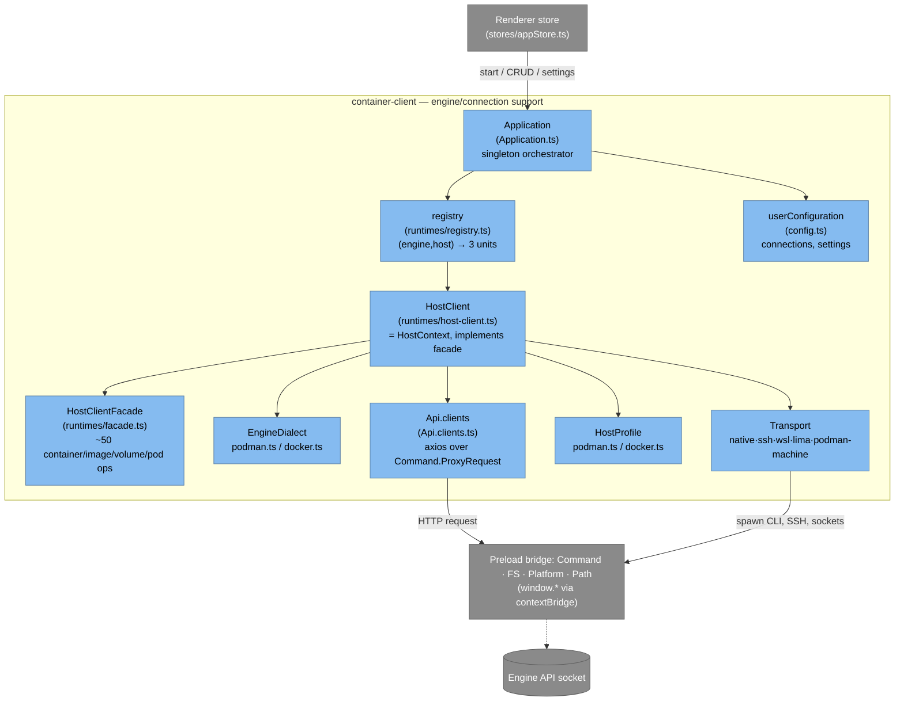

# Backend — Engine & Connection Support (C4 L3)

The "backend" is everything that turns *"connect me to this engine"* into a live,
pingable API the UI can call. It lives in [`src/container-client/`](../../src/container-client/)
and — despite the name — runs **in the renderer process**, reaching the OS through
the preload bridge (see [overview.md](overview.md)).

Its whole job: given a **Connection** (which engine, which host), produce a
**HostClient** that knows how to start the scope, find the engine socket, start
the API, and proxy requests to it.

## The core idea: one HostClient = Dialect × Transport × Profile

There are two engines (Podman, Docker) and five host types (native, machine/
vendor, WSL, Lima, SSH-remote) — ten combinations. Rather than ten inheritance
leaves, each combination is **composed** from three single-purpose units:

| Unit | Varies by | Answers | Source |
| --- | --- | --- | --- |
| **EngineDialect** | engine | "How do I speak to *this engine*?" — read its socket, build its service command, get system info | [`runtimes/dialects/{podman,docker}.ts`](../../src/container-client/runtimes/dialects/) |
| **Transport** | host type | "How do I reach a host of *this kind*?" — start/stop a scope, shape the API URI, run the API, build the driver | [`runtimes/transports/{native,ssh,wsl,lima,podman-machine}.ts`](../../src/container-client/runtimes/transports/) |
| **HostProfile** | (engine, host) | the thin glue — OS availability gate, automatic-settings detection, the per-host API-connection resolver | [`runtimes/profiles/{podman,docker}.ts`](../../src/container-client/runtimes/profiles/) |

A **registry** maps each `(engine, host)` pair to its three units; a factory
assembles them into a `HostClient`. The `HostClient` *is* the `HostContext` passed
back into those units' methods — so a Transport can call back into the engine's
Dialect through `host.dialect`, and vice-versa.

## The components

- **Application** — [`Application.ts`](../../src/container-client/Application.ts).
  The singleton the renderer talks to (`Application.getInstance()`). Owns the
  connection lifecycle (`start`, `stop`, `createConnectorContainerEngineHostClient`),
  connection CRUD, settings, and one-off engine actions (machines, kube, registries,
  security scans). It holds the active `HostClient` per connection id.
- **registry** — [`registry.ts`](../../src/container-client/runtimes/registry.ts).
  The ten-entry table `HOST_CLIENT_REGISTRY` and `createComposedHostClient()`.
  Stateless dialects/profiles are shared singletons; transports are created
  per-host (SSH/WSL/machine keep per-connection state). See
  [engine-matrix.md](engine-matrix.md) for the full table.
- **HostClient / HostContext** — [`host-client.ts`](../../src/container-client/runtimes/host-client.ts)
  + [`composition.ts`](../../src/container-client/runtimes/composition.ts). The
  composed object that implements the operations facade by delegating to its three
  units. It is passed back into them as `HostContext`, the shared "this".
- **HostClientFacade** — [`facade.ts`](../../src/container-client/runtimes/facade.ts).
  The uniform operations surface the UI consumes (containers, images, volumes,
  networks, pods, secrets, events, plus engine extensions like machines, contexts,
  swarm, compose). Named here, not enumerated — read the interface.
- **EngineDialect / Transport / HostProfile** — the three units above. Their
  contracts are defined once in [`composition.ts`](../../src/container-client/runtimes/composition.ts);
  Native's scope operations are intentional no-ops (symmetry over special-casing).
- **Api.clients** — [`Api.clients.ts`](../../src/container-client/Api.clients.ts).
  `createApplicationApiDriver()` returns an Axios instance whose every request is
  routed through `Command.ProxyRequest(req, connection)` — i.e. HTTP spoken over a
  unix socket / named pipe / SSH tunnel, executed in the preload's Node world. The
  SSH transport injects a `getSSHConnection` hook so the tunnel comes up lazily on
  first request.
- **userConfiguration** — [`config.ts`](../../src/container-client/config.ts).
  Persisted settings and the saved connection list (the one piece the main process
  also imports).

## Key types (the vocabulary)

All in [`src/env/Types.ts`](../../src/env/Types.ts):

- `ContainerEngine` — `PODMAN | DOCKER`.
- `ContainerEngineHost` — the ten `engine.host` values (e.g. `podman.native`,
  `docker.virtualized.wsl`).
- `ControllerScopeType` — `PodmanMachine | WSLDistribution | LIMAInstance |
  SSHConnection` (the kind of scope a non-native host runs in).
- `Connection` — a named, identified `(engine, host, settings)` the user picks.
- `Connector` — a `Connection` enriched with discovered `availability` (and
  `scopes`, `capabilities`); this is what the UI lists.
- `EngineConnectorSettings` — `{ api: { baseURL, connection: { uri, relay } },
  program, controller?, rootfull, mode }`, where `mode` is `automatic` or `manual`.
- `EngineConnectorAvailability` — the per-check result (`host`, `program`,
  `controller`, `api`, …) with a human-readable `report`.

## What happens at connect time

The ordered sequence — start scope → detect settings → start API → check
availability — is the subject of its own page:
**[connection-startup.md](connection-startup.md)**.

## Source map

| Component | Path |
| --- | --- |
| Orchestrator | [`Application.ts`](../../src/container-client/Application.ts) |
| Composition seam (interfaces) | [`runtimes/composition.ts`](../../src/container-client/runtimes/composition.ts) |
| Composed client | [`runtimes/host-client.ts`](../../src/container-client/runtimes/host-client.ts) |
| Registry (10 entries) | [`runtimes/registry.ts`](../../src/container-client/runtimes/registry.ts) |
| Operations facade | [`runtimes/facade.ts`](../../src/container-client/runtimes/facade.ts) |
| Dialects | [`runtimes/dialects/`](../../src/container-client/runtimes/dialects/) |
| Transports | [`runtimes/transports/`](../../src/container-client/runtimes/transports/) |
| Profiles | [`runtimes/profiles/`](../../src/container-client/runtimes/profiles/) |
| Connector defaults | [`connection.ts`](../../src/container-client/connection.ts) |
| API driver | [`Api.clients.ts`](../../src/container-client/Api.clients.ts) |
| Types | [`src/env/Types.ts`](../../src/env/Types.ts) |
