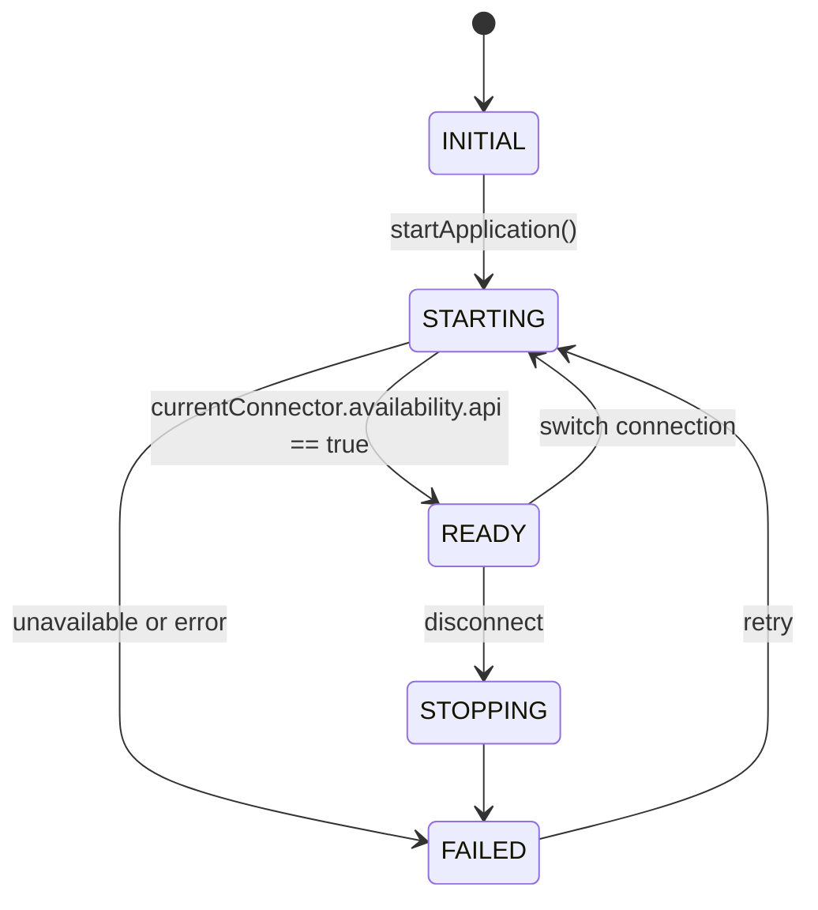
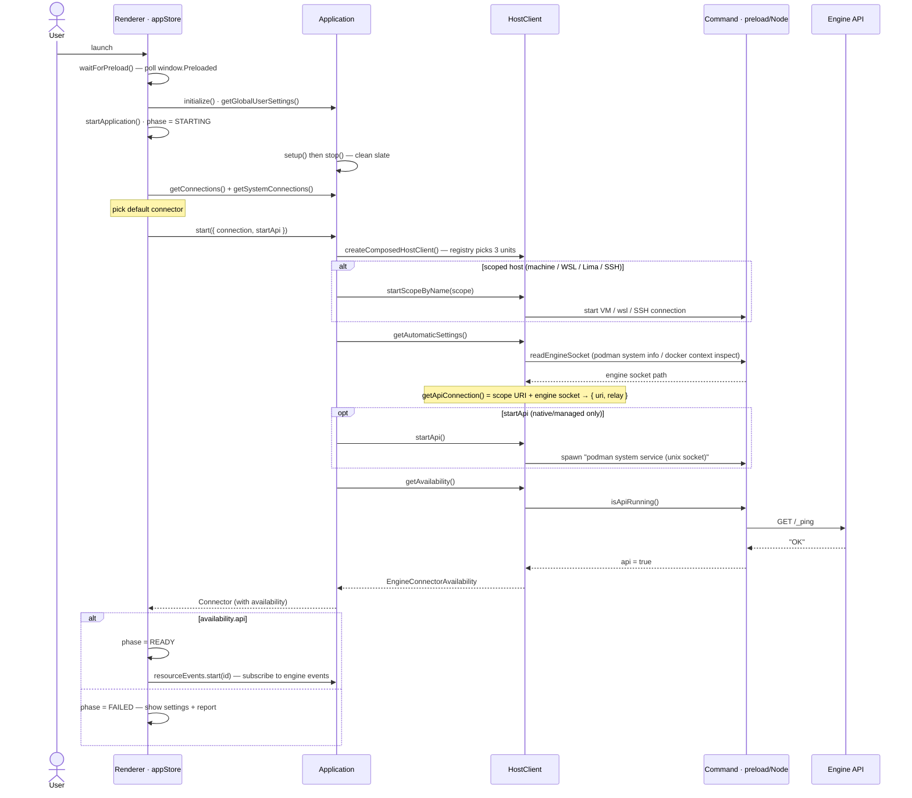
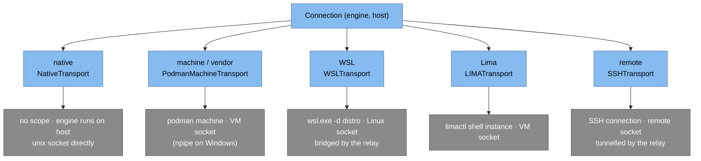
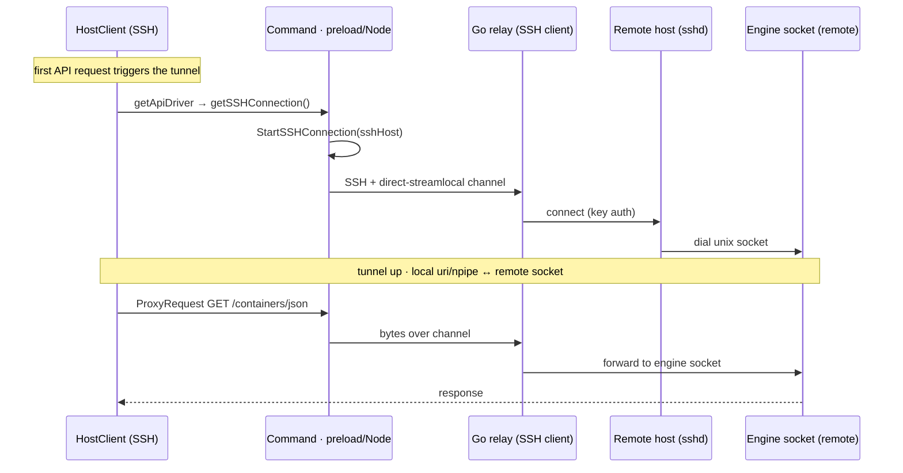
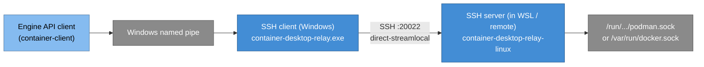
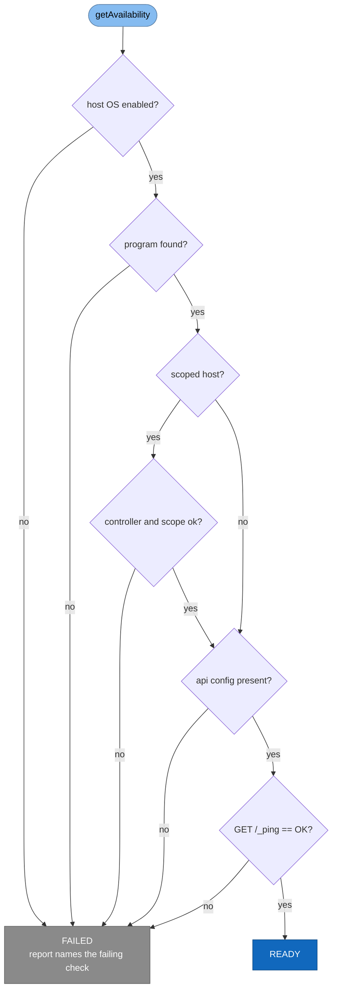

# ★ Connection Establishment at Startup

This is the most intricate flow in the app, and the one most worth understanding.
When container-desktop boots (or when you switch connections), it has to take a
**Connection** — *"Podman over SSH"*, *"Docker in WSL"*, *"Podman native"* — and
turn it into a live, pingable engine API. The steps differ per host type, but the
**ordering is always the same**:

> **start the scope → detect settings → start the API → check availability**

Two layers cooperate: the **renderer** drives lifecycle and phase
([`stores/appStore.ts`](../../src/web-app/stores/appStore.ts)); the **backend**
composes and establishes the connection
([`Application.ts`](../../src/container-client/Application.ts)).

## Phases (renderer side)

`AppBootstrapPhase` ([`App.types.ts`](../../src/web-app/App.types.ts)) is the UI's
state machine. Only the bold transitions are exercised in practice.

While `STARTING`, the backend emits `startup.phase` traces ("Starting setup",
"Reading settings", "Listing connections", "Establishing connection", …) that the
bootstrap screen shows live.

## The end-to-end sequence

The backend half (scope → settings → API → availability) is
`createConnectorContainerEngineHostClient()` in
[`Application.ts`](../../src/container-client/Application.ts); the renderer half is
`startApplication()` in [`appStore.ts`](../../src/web-app/stores/appStore.ts).

## How the scope & socket differ per host

The "establish scope / locate socket" step is the only part that varies. Each host
type's Transport implements it differently:

Notes per host:

- **native** ([`native.ts`](../../src/container-client/runtimes/transports/native.ts)) —
  no scope; for Podman, `startApi` spawns `podman system service … unix://<sock>`;
  Docker native has no managed service (the daemon is started outside the app).
- **machine / vendor** ([`podman-machine.ts`](../../src/container-client/runtimes/transports/podman-machine.ts)) —
  Podman machine VM; the socket comes from the machine. *(Docker's vendor host —
  Docker Desktop / Colima — is **unscoped** and uses the Native transport.)*
- **WSL** ([`wsl.ts`](../../src/container-client/runtimes/transports/wsl.ts)) —
  commands run via `wsl.exe -d <distro>`; the Windows side reaches the Linux socket
  through the **relay** (below).
- **Lima** ([`lima.ts`](../../src/container-client/runtimes/transports/lima.ts)) —
  commands run via `limactl shell <instance>`.
- **remote / SSH** ([`ssh.ts`](../../src/container-client/runtimes/transports/ssh.ts)) —
  an SSH connection whose tunnel is brought up **lazily on first request**.

### SSH: the lazy tunnel

The SSH transport doesn't open the tunnel during settings detection — it injects a
`getSSHConnection` hook into the API driver, so the connection is established the
first time a request actually needs it. Only a `RUNNING`/`STARTED` status counts as
connected.

## The relay's job

The Go relay ([`support/container-desktop-relay/`](../../support/container-desktop-relay/))
bridges a **named pipe or SSH channel** to a **Unix socket**, so a Windows or remote
client can speak to an engine socket that lives inside WSL or on another host. It is
an SSH server (listening on `:20022`, key auth) that handles
`direct-streamlocal@openssh.com` channels, plus — on Windows — an SSH client that
fronts a named pipe.

It also exposes health/readiness/metrics endpoints (`:20080/health`, `/ready`,
`:20090/metrics`) — handy when a connection mysteriously won't come up.

## The availability gate

`getAvailability()` is the final verdict. It runs the checks **in order** and
records a `report` for each, so a `FAILED` connection tells you exactly which step
broke. Only a successful `GET /_ping` (response `"OK"`) flips `api` to true and the
phase to `READY`.

## Function reference (where to look)

| Step | Function · file |
| --- | --- |
| Wait for preload | `waitForPreload` · [`Native.ts`](../../src/web-app/Native.ts) |
| Renderer bootstrap | `initialize`, `startApplication` · [`appStore.ts`](../../src/web-app/stores/appStore.ts) |
| Backend entry | `start`, `createConnectorContainerEngineHostClient` · [`Application.ts`](../../src/container-client/Application.ts) |
| Compose client | `createComposedHostClient` · [`registry.ts`](../../src/container-client/runtimes/registry.ts) |
| Start scope | `startScopeByName` · transport (e.g. [`ssh.ts`](../../src/container-client/runtimes/transports/ssh.ts)) |
| Detect settings | `getAutomaticSettings`, `readEngineSocket`, `getApiConnection` · profile/dialect |
| Start API | `startApi`, `buildServiceArgs` · [`native.ts`](../../src/container-client/runtimes/transports/native.ts) + dialect |
| Availability | `getAvailability`, `isApiRunning` (`/_ping`) · [`host-client.ts`](../../src/container-client/runtimes/host-client.ts) |
| Live events | `resourceEvents.start` · [`stores/resourceEvents.ts`](../../src/web-app/stores/resourceEvents.ts) |
