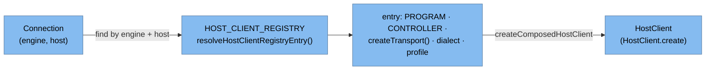
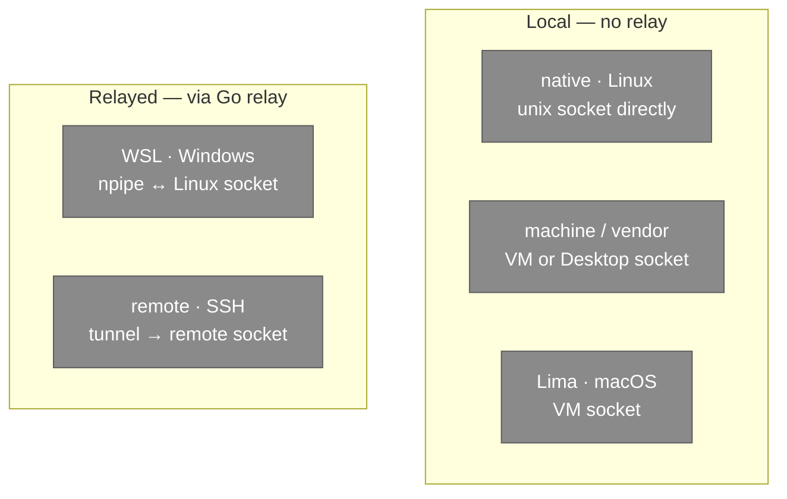

# Engine & Host Support Matrix

container-desktop supports **three engines across twelve connection hosts**: Podman
and Docker offer five host types each, and Apple Container offers two (native,
SSH-remote). Each is one entry in the registry, mapping a `(engine, host)` pair to
the three composition units (see [backend.md](backend.md)). This page is the lookup
table and how resolution works.

## The matrix

Rows are the `ContainerEngineHost` values
([`src/env/Types.ts`](../../src/env/Types.ts)); the wiring is from
[`runtimes/registry.ts`](../../src/container-client/runtimes/registry.ts) and the
OS gating from [`connection.ts`](../../src/container-client/connection.ts).

| Host (`ContainerEngineHost`) | Engine | Transport | Scope type | Controller | Enabled on | How the API socket is reached |
| --- | --- | --- | --- | --- | --- | --- |
| `podman.native` | Podman | Native | — | `podman` | Linux | direct unix socket |
| `podman.virtualized.vendor` | Podman | PodmanMachine | `PodmanMachine` | `podman` | all | machine VM socket (npipe on Windows) |
| `podman.virtualized.wsl` | Podman | WSL | `WSLDistribution` | `wsl` | Windows | named pipe ↔ Linux socket via **relay** |
| `podman.virtualized.lima` | Podman | Lima | `LIMAInstance` | `limactl` | macOS | Lima VM socket |
| `podman.remote` | Podman | SSH | `SSHConnection` | `ssh` | all | SSH tunnel → remote socket via **relay** |
| `docker.native` | Docker | Native | — | `docker` | Linux | direct unix socket |
| `docker.virtualized.vendor` | Docker | **Native** (unscoped) | — | `docker` | all | Docker Desktop / Colima socket (npipe on Windows) |
| `docker.virtualized.wsl` | Docker | WSL | `WSLDistribution` | `wsl` | Windows | named pipe ↔ Linux socket via **relay** |
| `docker.virtualized.lima` | Docker | Lima | `LIMAInstance` | `limactl` | macOS | Lima VM socket |
| `docker.remote` | Docker | SSH | `SSHConnection` | `ssh` | all | SSH tunnel → remote socket via **relay** |
| `container.native` | Apple Container | Native | — | `container` | macOS (Apple silicon) | socktainer unix socket (`~/.socktainer/container.sock`) |
| `container.remote` | Apple Container | SSH | `SSHConnection` | `ssh` | all | SSH tunnel → remote socktainer socket via **relay** |

Notes:

- **"Enabled on"** is the OS gate that decides whether the connector even shows up
  (`availability.enabled`). "all" connectors still need their controller/VM/engine
  actually installed to become *available*.
- **Docker vendor is the odd one out**: Docker Desktop (and Colima on macOS) is
  unscoped, so it uses the **Native** transport, not a machine transport — there is
  no VM the app manages. Everything else non-native runs inside a scope.
- **Apple Container is macOS/Apple-silicon only** and has no WSL/Lima/vendor/machine
  host — just native and SSH-remote. It exposes **no native REST API**; the
  **socktainer** bridge serves a Docker-compatible socket
  (`~/.socktainer/container.sock`), so it reuses the Docker API surface.
  `container.native` is gated to macOS; `container.remote` shows on all OSes (the remote
  must itself be an Apple-silicon Mac). Networks are gated by macOS version (full on
  macOS 26 / Darwin ≥ 25; degraded on macOS 15), and pods/secrets/compose/swarm/
  builders/contexts/kube/machines are unsupported.
- **Scope type** (`ControllerScopeType`) names the kind of thing the controller
  starts: a Podman machine, a WSL distribution, a Lima instance, or an SSH
  connection.
- **API base URL** seed differs by engine: Podman → `http://d`, Docker and Apple
  Container → `http://localhost` (the host part is irrelevant — requests go over the
  socket, not TCP).

## Controllers & engines (the programs involved)

| Program | Const | Role |
| --- | --- | --- |
| `podman` | `PODMAN_PROGRAM` | Podman engine + its own controller (native/machine) |
| `docker` | `DOCKER_PROGRAM` | Docker engine + its own controller (native/vendor) |
| `container` | `APPLE_PROGRAM` | Apple Container engine (native + SSH-remote) |
| `socktainer` | `SOCKTAINER_PROGRAM` | Docker-API bridge exposing the Apple Container socket |
| `wsl` (v2) | `WSL_PROGRAM` | controller for WSL hosts |
| `limactl` | `LIMA_PROGRAM` | controller for Lima hosts |
| `ssh` | `SSH_PROGRAM` | controller for remote hosts |

## How a connection resolves

Picking a connection is a pure table lookup, then composition:

Dialects and profiles are **stateless singletons** shared across connections;
**transports are created per host** (`createTransport()`) because SSH / WSL /
Podman-machine keep per-connection state (an open tunnel, a started VM). An unknown
`(engine, host)` pair throws — the twelve entries are the whole supported surface.

## Reaching the socket, by host family

The relayed paths are detailed in
[connection-startup.md](connection-startup.md#the-relays-job).

## Source map

| What | Path |
| --- | --- |
| Host enum & scope types | [`src/env/Types.ts`](../../src/env/Types.ts) (`ContainerEngineHost`, `ControllerScopeType`) |
| Registry (12 entries) | [`runtimes/registry.ts`](../../src/container-client/runtimes/registry.ts) |
| Connector defaults & OS gates | [`connection.ts`](../../src/container-client/connection.ts) (`getDefaultConnectors`) |
| Transports | [`runtimes/transports/`](../../src/container-client/runtimes/transports/) |
| Profiles | [`runtimes/profiles/`](../../src/container-client/runtimes/profiles/) |
