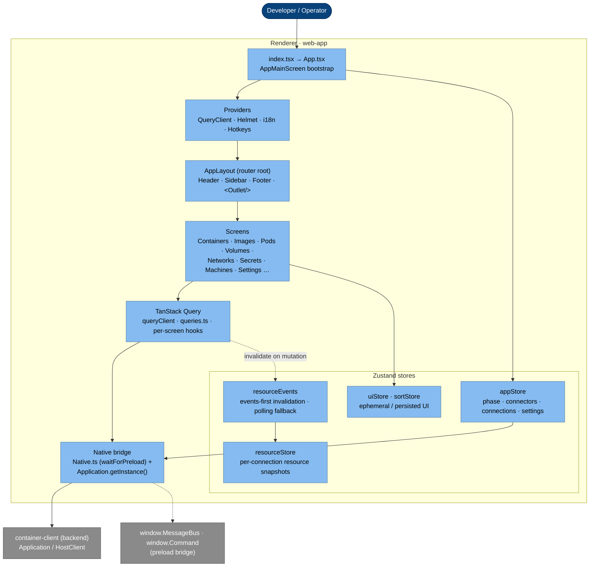

# Frontend — React Renderer (C4 L3)

The frontend is the React app in [`src/web-app/`](../../src/web-app/). It renders
the UI, holds client state, and drives the backend (the `container-client` engine
logic, which is bundled into the same renderer — see [overview.md](overview.md))
through a thin **Native bridge**.

Stack: **React 19** · **TanStack Router** (hash history, manual route tree) ·
**TanStack Query** (server-state cache) · **Zustand** (client state) ·
**Blueprint 6** (UI) · **xterm** + **monaco** (terminals / editors).

## C4 L3 — Components

## The components

**Bootstrap** — [`index.tsx`](../../src/web-app/index.tsx) mounts the provider
stack (`QueryClientProvider` › `I18nContextProvider` › `HelmetProvider` › `App`).
[`App.tsx`](../../src/web-app/App.tsx) builds the TanStack **Router** (hash
history, explicit route tree) and an `AppLayout` root route that draws the
persistent chrome — header, sidebar, footer — around the routed `<Outlet/>`.
`AppMainScreen` kicks off the startup sequence (see
[connection-startup.md](connection-startup.md)).

**State — Zustand stores** ([`src/web-app/stores/`](../../src/web-app/stores/)),
each one concern:

| Store            | Holds                                                                                                                                                                                                                                                                                                                                      |
| ---------------- | ------------------------------------------------------------------------------------------------------------------------------------------------------------------------------------------------------------------------------------------------------------------------------------------------------------------------------------------ |
| `appStore`       | bootstrap `phase`, `connectors` (availability matrix), `connections` (configured list), `currentConnector`, `userSettings`; the `initialize` / `startApplication` / connection-CRUD actions                                                                                                                                                |
| `resourceEvents` | a thin client over the **main-owned** data layer: `start()` begins mirroring main's pushes; `refresh()/refreshMany()` send a "refresh now" nudge to main. The engine `/events` stream + list fetching run in the **main process** (see [backend.md](backend.md#main-owned-data-layer))                                                                                                                                                |
| `resourceMirror` | applies the **main process's** pushed `ResourceSyncSnapshot`s into `resourceStore` (started by `resourceEvents.start()`) — same store, same screens (the seam). See [backend.md](backend.md#main-owned-data-layer) |
| `resourceStore`  | per-connection snapshots of containers/images/pods/volumes/networks/secrets (items, loading, lastError, eventsConnected)                                                                                                                                                                                                                   |
| `sortStore`      | sort specs, persisted to localStorage                                                                                                                                                                                                                                                                                                      |
| `uiStore`        | ephemeral per-screen UI (search, selection, overlays); reset on connection switch                                                                                                                                                                                                                                                          |

**Server state — TanStack Query** ([`src/web-app/domain/`](../../src/web-app/domain/)):
`queryClient.ts` configures a **cache-first** client (`staleTime: Infinity`). Freshness is
**events-first** — `resourceEvents` subscribes to the engine event stream and invalidates the
affected queries, so lists and details update from real engine events rather than a clock.
`liveQueryOptions()` is only a **fallback** (short stale time, polling), and that polling is
**scoped to the visible screen**: no background polling, no refetch-on-focus, and TanStack
pauses the interval while the page is hidden. Screen-level `queries.ts` hooks call the backend
and, on mutation, invalidate the cache and nudge `resourceEvents` to resync.

**Native bridge** — [`Native.ts`](../../src/web-app/Native.ts) +
`Application.getInstance()`. `waitForPreload()` blocks until the preload has
exposed `window.Preloaded`; after that the renderer can construct the
`Application` singleton (which captures `window.MessageBus`) and call the backend.
This is the single seam between UI and engine logic. The `Application`/`HostClient` is composed in the
renderer (for typing + per-engine normalizers), but its engine HTTP (`Command.ProxyRequest`) is forwarded to
the **main process**, so the renderer never opens its own connection — the app and tray share one (see
[backend.md](backend.md#main-owned-data-layer)).

## Screens

Screens live under [`src/web-app/screens/`](../../src/web-app/screens/), one folder
per domain. Each screen is a small contract: it exports a component plus
`Screen.ID`, `Screen.Title`, `Screen.Route`, and `Screen.Metadata` (icon), which
`App.tsx` registers as a route.

| Domain       | Folder          | Typical views                                                 |
| ------------ | --------------- | ------------------------------------------------------------- |
| Containers   | `Container/`    | manage · logs · inspect · stats · processes · terminal · kube |
| Dashboard    | `Dashboard/`    | landing                                                       |
| Images       | `Image/`        | manage · inspect · layers · security                          |
| Machines     | `Machine/`      | manage · inspect                                              |
| Networks     | `Network/`      | manage · inspect                                              |
| Pods         | `Pod/`          | manage · logs · inspect · processes · kube                    |
| Registries   | `Registry/`     | manage                                                        |
| Secrets      | `Secret/`       | manage · inspect                                              |
| Settings     | `Settings/`     | user settings · connection info · system info                 |
| Troubleshoot | `Troubleshoot/` | diagnostics                                                   |
| Volumes      | `Volume/`       | manage · inspect                                              |

Navigation helpers live in [`Navigator.ts`](../../src/web-app/Navigator.ts);
runtime config (environment, poll rate, doc links) in
[`Environment.ts`](../../src/web-app/Environment.ts).

## Cross-cutting UI

A few features span the whole app rather than a single screen:

- **Notification Center & Activity log** ([`components/NotificationCenter/`](../../src/web-app/components/NotificationCenter/)) —
  a right-side drawer opened from the footer bell. `Notification.show()` toasts are teed into
  the in-renderer `systemNotifier` bus; on top of that, every engine **API** call (intercepted
  in [`Api.clients.ts`](../../src/container-client/Api.clients.ts)) and every **CLI** invocation
  (captured by [`activityBus.ts`](../../src/platform/activityBus.ts) and
  bridged over `contextBridge`) is recorded. A capped, **in-memory, non-persisted** Zustand
  store ([`activityStore.ts`](../../src/web-app/stores/activityStore.ts)) feeds two filterable,
  date-ordered tabs (Notifications · Activity); activity rows show status/duration and expand to
  a copy-as-cURL / copy-command view — doubling as a live learning log of how the engine is driven.
- **In-app Find** ([`components/Find/`](../../src/web-app/components/Find/)) — a global
  Ctrl/Cmd+F widget mounted once (`FindHost`) that routes to the right search engine per surface:
  the xterm `SearchAddon` for logs/terminals, the CSS Custom Highlight API for DOM views
  (inspect/processes), monaco's native find for editors, and the existing filter box on lists.
- **Configurable monospace font** — logs, terminals and code views read CSS variables
  (`--monospace-font*`) set in [`App.tsx`](../../src/web-app/App.tsx) from user settings; the
  default is the bundled **JetBrains Mono** ([`themes/`](../../src/web-app/themes/)), and Settings
  offers a filterable family picker plus size/weight.
- **Live container logs** — running containers stream logs (Docker multiplexed frames decoded in
  [`logs.ts`](../../src/container-client/logs.ts)); the terminal coalesces writes per animation
  frame and a status pill (`LiveLogBadge`) shows LIVE / CONNECTING / ENDED / SNAPSHOT.

## Source map

| Component                      | Path                                                                                                                                                                                                                                       |
| ------------------------------ | ------------------------------------------------------------------------------------------------------------------------------------------------------------------------------------------------------------------------------------------ |
| App / router / layout          | [`App.tsx`](../../src/web-app/App.tsx) · [`App.types.ts`](../../src/web-app/App.types.ts)                                                                                                                                                  |
| Entry / providers              | [`index.tsx`](../../src/web-app/index.tsx)                                                                                                                                                                                                 |
| In-app Find                    | [`components/Find/`](../../src/web-app/components/Find/)                                                                                                                                                                                   |
| Live logs                      | [`container-client/logs.ts`](../../src/container-client/logs.ts) · [`components/LiveLogBadge.tsx`](../../src/web-app/components/LiveLogBadge.tsx)                                                                                          |
| Native bridge                  | [`Native.ts`](../../src/web-app/Native.ts)                                                                                                                                                                                                 |
| Navigation / env               | [`Navigator.ts`](../../src/web-app/Navigator.ts) · [`Environment.ts`](../../src/web-app/Environment.ts)                                                                                                                                    |
| Notification Center / Activity | [`components/NotificationCenter/`](../../src/web-app/components/NotificationCenter/) · [`stores/activityStore.ts`](../../src/web-app/stores/activityStore.ts) · [`platform/activityBus.ts`](../../src/platform/activityBus.ts) |
| Query layer                    | [`domain/queryClient.ts`](../../src/web-app/domain/queryClient.ts) · [`domain/queries.ts`](../../src/web-app/domain/queries.ts)                                                                                                            |
| Screens                        | [`screens/`](../../src/web-app/screens/)                                                                                                                                                                                                   |
| Stores                         | [`stores/`](../../src/web-app/stores/)                                                                                                                                                                                                     |
