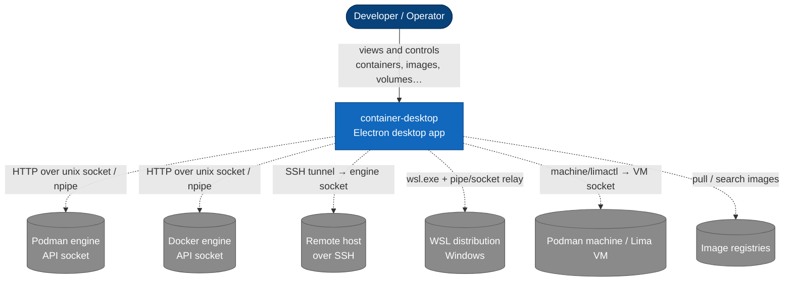
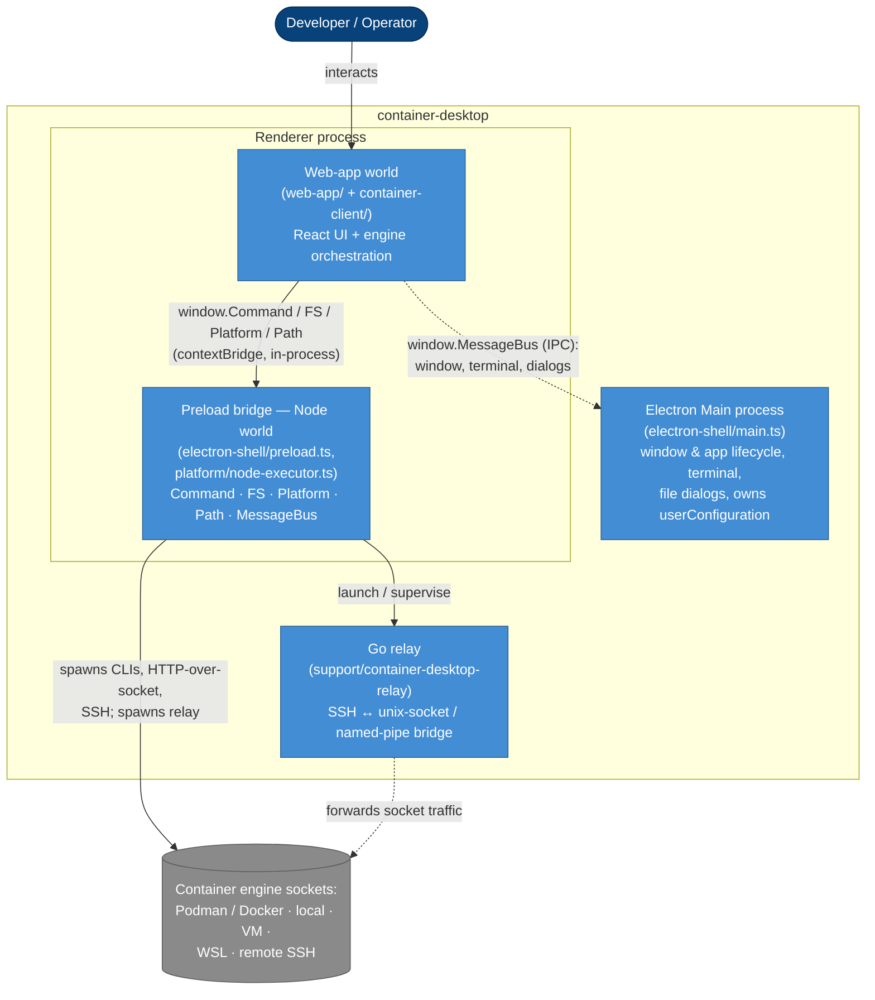

# Overview — System Context & Containers (C4 L1 + L2)

container-desktop is a cross-platform Electron desktop app for managing container
engines (Podman / Docker), whether they run locally, inside a VM, inside WSL, or
on a remote host over SSH. This page is the big picture; [backend.md](backend.md)
and [frontend.md](frontend.md) zoom in.

## C4 L1 — System Context

Who uses the app and what it talks to.

The app is a **client** of engine API sockets. It never reimplements the engine —
it discovers, starts, and proxies to the engine's REST API (the Podman/libpod or
Docker socket), then renders the results.

## C4 L2 — Containers (runnable pieces)

The app is **three runtimes** in one repo (see [`CLAUDE.md`](../../CLAUDE.md) for
the build model): a Node/TypeScript Electron app, a Go relay, and Python build
tooling (not shown — it builds, it doesn't run at app runtime).

The interesting and slightly unusual part is **where the engine logic runs**: the
`container-client` "backend" executes **in the renderer process**, not the main
process. Privileged Node I/O is injected into it from the **preload** through
Electron's `contextBridge`. The main process is the thin privileged shell.

### The pieces

- **Electron Main process** — `src/electron-shell/main.ts`. Creates the
  `BrowserWindow`, handles app/window lifecycle and a small set of IPC channels
  (`window.*`, `application.*`, `openTerminal`, `openFileSelector`, `notify`), and
  owns `userConfiguration` (settings persistence). It does **not** broker engine
  calls.
- **Renderer process** — one OS process, two JavaScript worlds kept apart by
  `contextIsolation`:
  - **Web-app world** — `src/web-app/` (React UI) plus the bundled
    `src/container-client/` engine logic. This is where a connection is composed
    and driven (see [backend.md](backend.md)). It has no direct Node access.
  - **Preload bridge** — `src/electron-shell/preload.ts` exposes the real
    Node-side primitives from `src/platform/` via `contextBridge`:
    `Command` (process spawn, `ProxyRequest` = HTTP over a unix socket / named
    pipe, `StartSSHConnection`), `FS`, `Platform`, `Path`, and `MessageBus`.
    Engine I/O physically happens here, in Node.
- **Go relay** — `support/container-desktop-relay/`. A spawned helper that bridges a
  Windows named pipe to a Unix socket — inside **WSL** via a stdio bridge (no SSH server in
  the distro), or to a **remote host over SSH** on Windows. Linux/macOS remote SSH uses the
  native `ssh` client instead. See [connection-startup.md](connection-startup.md).
- **External engines** — Podman/Docker REST sockets, reachable directly (native),
  through a VM (machine/Lima), through WSL, or across SSH.

### Build/runtime note (don't relearn the hard way)

Source is ESM/TypeScript, but **main and preload are bundled to CommonJS** —
Electron's API only links via the CJS `require` hook — while the **renderer stays
ESM**. Production needs `ENVIRONMENT=production`. Full details live in
[`CLAUDE.md`](../../CLAUDE.md) → *Build / runtime model*; they are not repeated
here.

## Source map

| Piece | Path |
| --- | --- |
| Main process | [`src/electron-shell/main.ts`](../../src/electron-shell/main.ts) |
| Preload bridge | [`src/electron-shell/preload.ts`](../../src/electron-shell/preload.ts) |
| Node primitives (`Command`) | [`src/platform/node-executor.ts`](../../src/platform/node-executor.ts) · [`src/platform/node.ts`](../../src/platform/node.ts) |
| IPC bus | [`src/electron-shell/shared.ts`](../../src/electron-shell/shared.ts) |
| Engine logic (backend) | [`src/container-client/`](../../src/container-client/) |
| React renderer (frontend) | [`src/web-app/`](../../src/web-app/) |
| Go relay | [`support/container-desktop-relay/`](../../support/container-desktop-relay/) |
