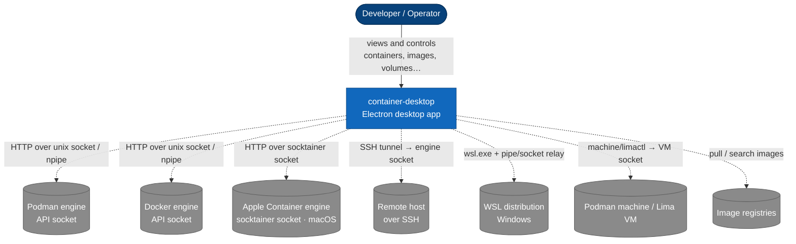
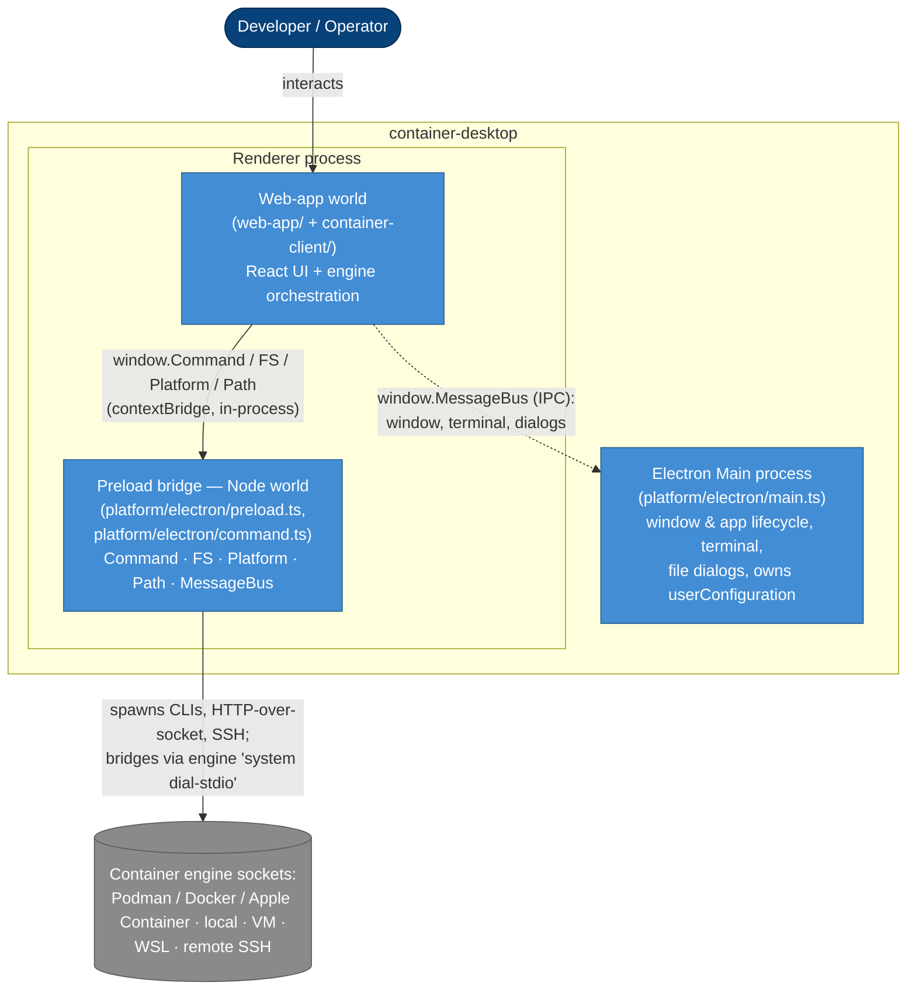

# Overview — System Context & Containers (C4 L1 + L2)

container-desktop is a cross-platform Electron desktop app for managing container
engines (Podman, Docker, and Apple Container), whether they run locally, inside a
VM, inside WSL, or on a remote host over SSH. This page is the big picture; [backend.md](backend.md)
and [frontend.md](frontend.md) zoom in.

## C4 L1 — System Context

Who uses the app and what it talks to.

The app is a **client** of engine API sockets. It never reimplements the engine —
it discovers, starts, and proxies to the engine's REST API (the Podman/libpod,
Docker, or Apple Container socket — the last exposed by **socktainer**), then
renders the results.

## C4 L2 — Containers (runnable pieces)

The app is a Node/TypeScript Electron app (see [`CLAUDE.md`](../../CLAUDE.md) for
the build model), with a TypeScript build CLI in `support/cli/` (not shown — it
builds, it doesn't run at app runtime).

The interesting and slightly unusual part is **where the engine logic runs**: the
`container-client` "backend" executes **in the renderer process**, not the main
process. Privileged Node I/O is injected into it from the **preload** through
Electron's `contextBridge`. The main process is the thin privileged shell.

### The pieces

- **Electron Main process** — `src/platform/electron/main.ts`. Creates the
  `BrowserWindow`, handles app/window lifecycle and a small set of IPC channels
  (`window.*`, `application.*`, `openTerminal`, `openFileSelector`, `notify`), and
  owns `userConfiguration` (settings persistence). It does **not** broker engine
  calls.
- **Renderer process** — one OS process, two JavaScript worlds kept apart by
  `contextIsolation`:
  - **Web-app world** — `src/web-app/` (React UI) plus the bundled
    `src/container-client/` engine logic. This is where a connection is composed
    and driven (see [backend.md](backend.md)). It has no direct Node access.
  - **Preload bridge** — `src/platform/electron/preload.ts` exposes the real
    Node-side primitives from `src/platform/electron/` via `contextBridge`:
    `Command` (process spawn, `ProxyRequest` = HTTP over a unix socket / named
    pipe, `StartSSHConnection`), `FS`, `Platform`, `Path`, and `MessageBus`.
    Engine I/O physically happens here, in Node.
- **Socket bridge (in-process)** — for hosts whose engine socket isn't locally reachable, the
  preload runs an in-process Node bridge server that fronts a local pipe/socket and pumps bytes to
  the engine's own `docker`/`podman system dial-stdio`. `WSLRelayServer`
  ([`exec/wsl-relay.ts`](../../src/platform/electron/exec/wsl-relay.ts)) fronts a Windows named pipe and
  runs `wsl.exe --exec … system dial-stdio` inside the distro (no SSH server in the distro);
  `SSHStdioBridgeServer` ([`exec/ssh-stdio-bridge.ts`](../../src/platform/electron/exec/ssh-stdio-bridge.ts))
  runs `system dial-stdio` on a **remote host over SSH**. Linux/macOS remote SSH can also use the
  native `ssh` client's port forward. See [connection-startup.md](connection-startup.md).
- **External engines** — Podman/Docker REST sockets, plus Apple Container's
  Docker-compatible socket exposed by **socktainer** (macOS/Apple-silicon),
  reachable directly (native), through a VM (machine/Lima), through WSL, or across SSH.

### Build/runtime note (don't relearn the hard way)

Source is ESM/TypeScript, but **main and preload are bundled to CommonJS** —
Electron's API only links via the CJS `require` hook — while the **renderer stays
ESM**. Production needs `ENVIRONMENT=production`. Full details live in
[`CLAUDE.md`](../../CLAUDE.md) → *Build / runtime model*; they are not repeated
here.

## Source map

| Piece | Path |
| --- | --- |
| Main process | [`src/platform/electron/main.ts`](../../src/platform/electron/main.ts) |
| Preload bridge | [`src/platform/electron/preload.ts`](../../src/platform/electron/preload.ts) |
| Electron host ports | [`host.ts`](../../src/platform/electron/host.ts) |
| Electron command facade | [`command.ts`](../../src/platform/electron/command.ts) + [`exec/`](../../src/platform/electron/exec/) |
| IPC bus | [`messageBus.ts`](../../src/platform/electron/messageBus.ts) |
| Engine logic (backend) | [`src/container-client/`](../../src/container-client/) |
| React renderer (frontend) | [`src/web-app/`](../../src/web-app/) |
| Platform-port naming | [`platform-ports.md`](platform-ports.md) |
| Socket bridge servers | [`exec/ssh-stdio-bridge.ts`](../../src/platform/electron/exec/ssh-stdio-bridge.ts) · [`exec/wsl-relay.ts`](../../src/platform/electron/exec/wsl-relay.ts) |
