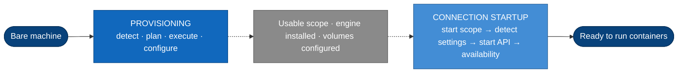
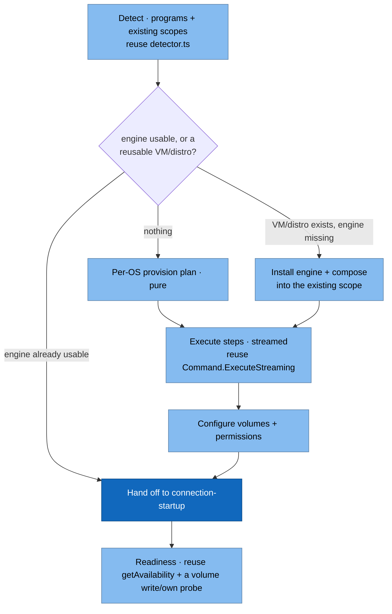
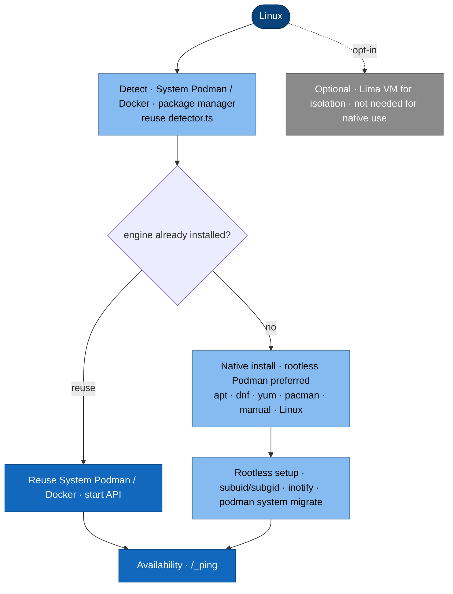
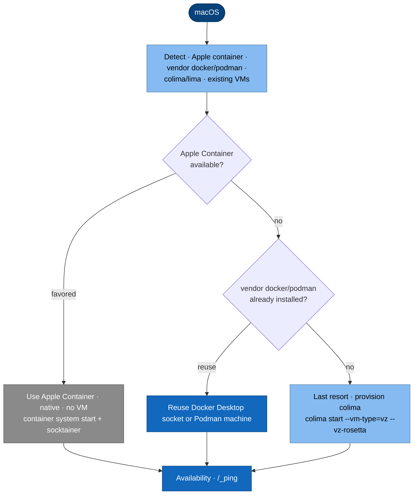
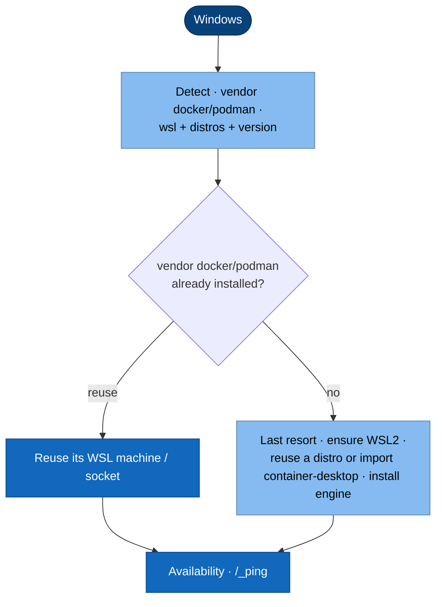

# Provisioning — from a bare machine to a usable scope

> **Status: PROPOSAL — for debate, not yet implemented.** Unlike the rest of
> `docs/architecture/` (which describes current code), this page proposes the
> *provisioning* feature and exists so we can argue the per-OS flows before writing
> code. Diagrams follow the house [C4 + Mermaid](../README.md#how-to-read-the-diagrams) style.

## What provisioning is (and where it stops)

Today the app can only *connect* to an engine that is **already installed and
running**. Provisioning is the missing phase before that: take a machine from
*"nothing installed"* to *"a usable scope with an engine and working volumes"* —
then hand off to the existing startup flow.

**The golden rule is reuse.** Provisioning does **not** re-implement VM lifecycle,
socket bridging, or availability checks — those already exist. It ends exactly where
[connection-startup.md](connection-startup.md) begins:

Everything right of the dashed boundary is **already built** — the transports, the
`system dial-stdio` bridges, the availability gate. Provisioning only has to make the
scope *exist*.

> The concrete per-engine install commands are **not** restated here — they live in
> the user manual and provisioning drives those same recipes:
> [Linux](../../website-src/manual/linux.md) · [macOS](../../website-src/manual/macos.md) ·
> [Windows](../../website-src/manual/windows.md).

## The priority ladder

Reuse beats provisioning, and an OS-native lightweight runtime beats a VM. Every OS
follows the same ladder — **reuse what's installed → prefer the OS-native runtime →
auto-provision our own VM/distro only as a last resort:**

| OS | Favored · native | Reuse · already installed | Last resort · we provision |
| --- | --- | --- | --- |
| macOS | Apple Container | Docker Desktop · Podman Desktop · podman machine | colima (Lima · VZ + rosetta) |
| Windows | — | Docker Desktop · Podman Desktop · podman machine (WSL) | WSL distro — reuse one or import `container-desktop` |
| Linux | — *(native is the norm)* | System Podman · System Docker | native package install · rootless Podman preferred |

The favored macOS rung — **Apple Container** — is a native, per-container runtime that
needs no Linux VM the app manages. We only descend a rung when the one above isn't
available. *(Windows has no shipping native runtime yet — Microsoft's is still in preview.)*

## The shared flow (engine- and OS-agnostic)

One orchestration, four moves. Only *plan* and *execute* differ per OS; *detect*,
*configure volumes*, and *readiness* are shared.

Progress is streamed to the renderer exactly like connect/reconnect progress is
today (per-connection `resource:progress`); readiness reuses the same
`getAvailability()` gate the startup flow already reports.

## Per-OS flows

### Linux — reuse System engines, else native install

Favored: reuse the already-installed **System Podman / System Docker** (the app's
system connections). If nothing is installed, provision **natively** via the package
manager — **rootless Podman preferred** (no daemon, best security), Docker if chosen.
No VM; a Lima VM is **opt-in only** (isolation/parity), never required. Reuses the
distro-detection idiom in [`support/provision-deps.sh`](../../support/provision-deps.sh)
and the [Linux manual](../../website-src/manual/linux.md) recipes.

### macOS — ladder: Apple Container → vendor → colima

Favored order: **Apple Container** (native, no VM) → **vendor-installed Docker/Podman**
(Docker Desktop, Podman Desktop, the Podman standalone installer's machine) → **colima**
*only as a last resort*. We reuse what's already installed; colima is provisioned
(`--vm-type=vz --vz-rosetta` — the key to volume-mount permissions + x86) only when
nothing above is present. See [macOS manual](../../website-src/manual/macos.md).

### Windows — ladder: vendor → WSL distro

Favored order: **vendor-installed Docker/Podman** (Docker Desktop, Podman Desktop, the
Podman standalone installer's WSL machine) → a **WSL distro** (reuse one, or import a
dedicated `container-desktop` distro) *as a last resort*. Installing the engine inside a
distro reuses the same Linux recipe — "get a distro, then run the Linux flow inside it".
Microsoft's native per-container runtime is still in preview, so it's out of scope for now.
See [Windows manual](../../website-src/manual/windows.md).

## Volumes & permissions — the make-or-break, auto-configured

The whole point is that editing on the host and running in a container yields
correct, writable, watchable files with **zero manual `chown`**. Provisioning
resolves this per OS × engine and applies it for you:

| OS · engine | Mount | Ownership strategy | Note |
| --- | --- | --- | --- |
| macOS · Podman/Docker (Lima/colima) | virtiofs (VZ) | `--userns=keep-id` + `:U` (rootless) | `--vz-rosetta` fixes perms + x86 — see macOS manual |
| Windows · Podman/Docker (WSL2) | native ext4 | `--userns=keep-id`; steer projects into the Linux FS | never `/mnt/c` — inotify + perms break |
| Linux · rootless Podman | native bind | `--userns=keep-id` + `:U` | needs subuid/subgid (usually present) |
| Linux · rootful Docker | native bind | run as `-u $(id -u):$(id -g)` | — |

> The favored native runtime — **Apple Container** — manages host mounts itself (no
> `keep-id` needed); the strategies above apply to the Linux-VM and native-Linux rungs
> of the ladder.

Readiness proves it live: write a probe file inside a shared folder and confirm it
comes back owned by the user, and that inotify fires.

## Reuse map — what we lean on vs. what is genuinely new

| Concern | Reuse (already exists) | Net-new (small) |
| --- | --- | --- |
| Detect programs | `detector.ts` `findProgramPath/Version` | reuse-detection that bypasses the `listScopes` `isEngineAvailable` gate |
| Existing VMs/distros | `getControllerScopes`, transports | raw enumerators for "VM exists, engine missing" |
| VM lifecycle | Lima/podman-machine transports (`startScope`) | Lima/colima **create-from-template**; `wsl --import` + first-boot install |
| Engine install | the manual's per-OS recipes | a per-distro action map (Linux) driving those recipes |
| Streamed progress | `Command.ExecuteStreaming`, `resource:progress` | provisioning progress topic (mirror, don't reinvent) |
| Target a new connection | `connectHostClient` / `getHostClientFor` | — |
| Readiness | `getAvailability()` gate | a volume write/own + inotify probe |
| Handoff to a live engine | the whole [connection-startup](connection-startup.md) flow | — |

## Open questions — to debate

*(The per-OS backend order is settled by the [priority ladder](#the-priority-ladder) above.)*

> **Vendor reuse depth.** When Docker Desktop / Podman Desktop is already installed, do we
> just *connect* (today's behaviour) or also offer to start/manage its lifecycle?

> **Automate vs. hand to the manual.** WSL feature enablement, Homebrew, colima, and
> Apple Container / socktainer need admin steps or signed downloads. Where's the line
> between "the wizard runs it" and "the wizard links the manual with copy-commands"?

> **Reuse-detection.** Fix `listScopes` to honor `skipAvailabilityCheck`, or add a
> dedicated raw enumerator so "VM/distro exists but engine not installed" is detectable?

## Source map

| What | Path |
| --- | --- |
| Detection | [`detector.ts`](../../src/container-client/detector.ts) |
| Transports (start/list scope) | [`runtimes/transports/`](../../src/container-client/runtimes/transports/) |
| Target-bound host | `connectHostClient`, `getHostClientFor` · [`Application.ts`](../../src/container-client/Application.ts) |
| Machine CRUD | `createPodmanMachine` · [`Application.ts`](../../src/container-client/Application.ts) |
| Streamed exec | `ExecuteStreaming` · [`command.ts`](../../src/platform/electron/command.ts), [`exec/commander.ts`](../../src/platform/electron/exec/commander.ts) |
| Progress bridge | `resource:progress` · [`resourceBus.ts`](../../src/platform/electron/resourceBus.ts), [`engineDataService.ts`](../../src/platform/engineDataService.ts) |
| Readiness gate | `getAvailability` · [`host-client.ts`](../../src/container-client/runtimes/host-client.ts) |
| Handoff (startup) | [connection-startup.md](connection-startup.md), [engine-matrix.md](engine-matrix.md) |
| Linux install idiom | [`support/provision-deps.sh`](../../support/provision-deps.sh) |
| Common-case recipes | manual: [Linux](../../website-src/manual/linux.md) · [macOS](../../website-src/manual/macos.md) · [Windows](../../website-src/manual/windows.md) |
