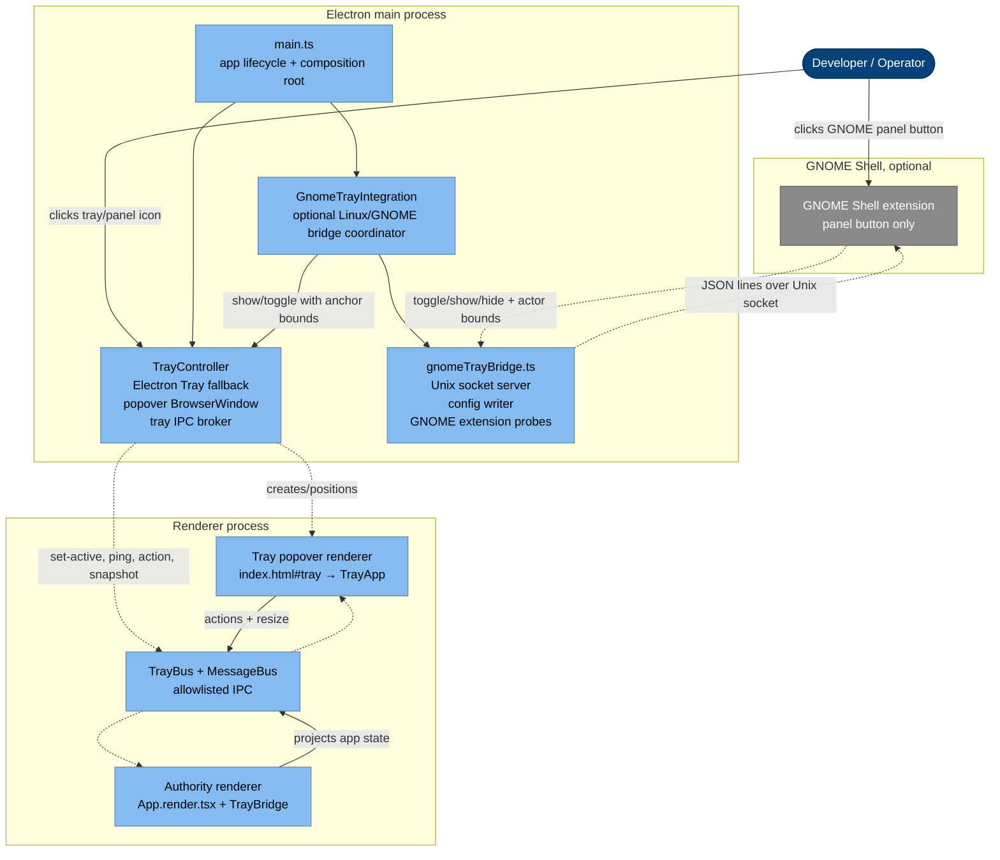
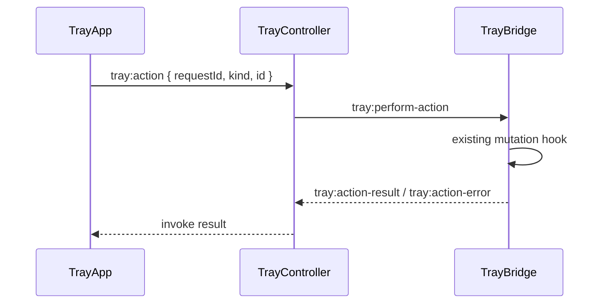
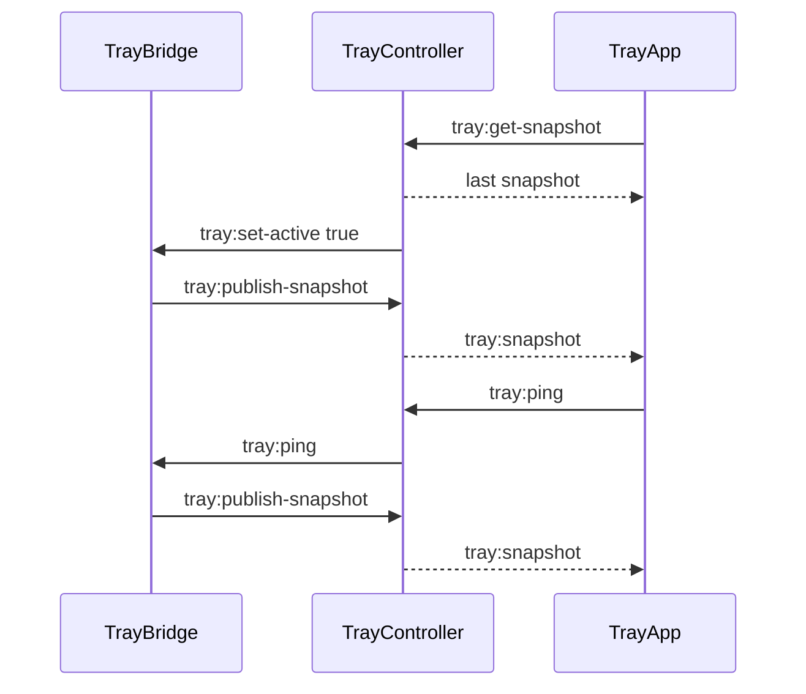

# System tray — optional shell bridge (C4 L2/L3)

The tray widget is a small React surface backed by the normal application
stores. It must feel native on every desktop, but Linux desktops do not expose a
single reliable "tray icon left click opens my custom window" contract. The
architecture is therefore layered:

- use a normal Electron tray everywhere it works;
- keep a native-menu fallback when a desktop only supports AppIndicator /
  StatusNotifier semantics;
- use an **optional** GNOME Shell extension as a click/anchor bridge when GNOME
  can load it;
- never require the bridge for the app to run.

The GNOME extension is not the product UI. It is only a panel button that sends
click geometry to the app; the actual widget remains the same React tray window.

## Tray data, grouping, and the main-owned migration

Today the popover's data is projected by `TrayBridge` in the authority renderer
([`snapshot.ts`](../../src/web-app/tray/snapshot.ts)), and the container rows reuse the **main Containers
screen's grouping** ([`grouping.ts`](../../src/web-app/screens/Container/grouping.ts) →
`groupContainers`/`containerGroups`) so the tray tree matches the main list (compose-project / name-prefix
groups, "Pod infrastructure" pinned on top).

The requirement that the tray work **independently of the main app window** drove the **main-owned data
layer** (see [backend.md → Main-owned data layer](backend.md#main-owned-data-layer)): the engine `/events`
stream + list fetching now live in the main process, and the renderer — including the tray's `TrayBridge`
authority — reads main's pushed snapshots via the mirror. The remaining follow-up is to retire `TrayBridge`
and have **main build the tray snapshot directly**, so the tray runs with no main window open at all.

## Runtime shape



There are two renderer entries:

- the **authority renderer** is the main app window. It mounts `TrayBridge` inside
  the normal provider stack, so tray actions use the same stores, queries, and
  mutations as the full app;
- the **popover renderer** is loaded from the same renderer bundle at
  `index.html#tray`. It imports only `renderTray()` and draws `TrayApp`.

`TrayController` is the main-process broker between them. It owns the Electron
`Tray`, the frameless tray `BrowserWindow`, popover positioning, action request
timeouts, and channel validation. It only accepts authority messages from the
main app `BrowserWindow` and popover messages from the tray `BrowserWindow`.

## Platform behavior

| Platform / shell                                    | Preferred path                                                                                      | Fallback                                                                              |
| --------------------------------------------------- | --------------------------------------------------------------------------------------------------- | ------------------------------------------------------------------------------------- |
| GNOME Shell with active Container Desktop extension | Extension panel button sends bounds; Electron opens the same React popover anchored to that button. | Electron tray fallback is restored if the extension disables or never becomes active. |
| Linux AppIndicator / StatusNotifier-only desktops   | Native menu is the reliable contract.                                                               | React popover may still be opened by menu when geometry is usable.                    |
| Linux desktops where Electron click events work     | Electron tray click toggles the React popover.                                                      | Native tray menu.                                                                     |
| macOS                                               | Electron tray click toggles the React popover.                                                      | Native tray menu with Open widget / Quit.                                             |
| Windows                                             | Electron tray click toggles the React popover.                                                      | Native tray menu with Open widget / Quit.                                             |

Do not make the GNOME extension a hard runtime dependency. If the extension is
not installed, not enabled, not active in the current session, or cannot connect
to the socket, the app keeps the normal Electron tray fallback.

## GNOME bridge contract

The bridge is intentionally tiny:

1. On Linux/GNOME startup, `GnomeTrayIntegration` writes
   `~/.config/container-desktop/gnome-tray-bridge.json`. The file contains the
   Unix socket path, app command/args, working directory, and tray icon path.
2. `gnomeTrayBridge.ts` listens on
   `$XDG_RUNTIME_DIR/container-desktop/gnome-tray-bridge.sock`.
3. The GNOME extension adds a panel button. On primary or secondary click it
   sends one JSON line to the socket:

   ```json
   { "type": "toggle", "bounds": { "x": 0, "y": 0, "width": 24, "height": 24 } }
   ```

4. If the app is not running, the extension spawns the configured command with
   `--container-desktop-gnome-tray-toggle x y width height`. The existing
   single-instance path then routes that request back to the running app or
   starts hidden and shows the popover once ready.
5. When the extension sends `ready`, the Electron tray fallback is suppressed.
   When it sends `disabled`, the fallback is restored.

The extension must stay boring: no React, no business logic, no engine calls, no
settings UI. It exists only because GNOME Shell owns the panel and can provide
correct click behavior and actor bounds.

## Distribution rule

Packaging may include the extension files, but package install is not the same
thing as an active GNOME Shell extension. On GNOME Wayland, locally installed
extension files are commonly discovered only after the Shell session reloads or
the user logs out and back in. Because of that:

- production startup must not assume it can install and activate the extension
  seamlessly;
- auto-install helpers are development conveniences only;
- if a seamless GNOME user flow is required, publish the extension through
  GNOME's extension distribution path and let users enable it there;
- the app must always remain useful without the extension.

This is why `GnomeTrayIntegration` suppresses the fallback tray only when the
extension is actually `ACTIVE` or when the extension connects and sends `ready`.
An installed or enabled extension that is not active is treated as absent.

## Tray IPC protocol

The tray protocol has three parties:

| Party                             | Role                                                                                                                                                              |
| --------------------------------- | ----------------------------------------------------------------------------------------------------------------------------------------------------------------- |
| Authority renderer (`TrayBridge`) | Builds snapshots from Zustand stores, TanStack Query data, resource slices, machines, pods, and optional stats. Performs actions through existing mutation hooks. |
| Main broker (`TrayController`)    | Stores the last snapshot, validates message origin, forwards pushes, creates request IDs/timeouts, resizes and positions the popover.                             |
| Popover renderer (`TrayApp`)      | Renders the compact UI, asks for the first snapshot, sends visible-only pings, actions, resize requests, show-main, and quit.                                     |

The popover drives refresh cadence while visible. When hidden, the authority
bridge unsubscribes from store updates and stops stats refresh. This keeps the
tray widget from becoming a second background polling app.

Action flow:



Snapshot flow:



## Design constraints

- Keep `main.ts` as a composition root. Tray behavior belongs in
  `TrayController`, `GnomeTrayIntegration`, and `gnomeTrayBridge`.
- Keep the React tray UI platform-neutral. Platform-specific behavior stops at
  window creation, positioning, and shell click delivery.
- Keep `TrayBus` allowlisted. A renderer can subscribe only to tray channels, and
  the raw Electron event never crosses into the renderer world.
- Keep the GNOME bridge local-user scoped: config in `XDG_CONFIG_HOME`, socket in
  `XDG_RUNTIME_DIR`, user-only file modes where possible.
- Treat native Linux menus as a valid fallback, not as a failure path. Some
  desktops deliberately only expose menu semantics for tray indicators.

## Source map

| Piece                         | Path                                                                                                                                                                                                   |
| ----------------------------- | ------------------------------------------------------------------------------------------------------------------------------------------------------------------------------------------------------ |
| Authority renderer bridge     | [`src/web-app/tray/TrayBridge.tsx`](../../src/web-app/tray/TrayBridge.tsx)                                                                                                                             |
| GNOME bridge coordinator      | [`src/electron-shell/gnomeTrayIntegration.ts`](../../src/electron-shell/gnomeTrayIntegration.ts)                                                                                                       |
| GNOME bridge utilities/socket | [`src/electron-shell/gnomeTrayBridge.ts`](../../src/electron-shell/gnomeTrayBridge.ts)                                                                                                                 |
| GNOME Shell extension         | [`support/gnome-shell-extension/container-desktop-tray@iongion.github.io/`](../../support/gnome-shell-extension/container-desktop-tray@iongion.github.io/)                                             |
| Main composition root         | [`src/electron-shell/main.ts`](../../src/electron-shell/main.ts)                                                                                                                                       |
| Popover UI                    | [`src/web-app/tray/TrayApp.tsx`](../../src/web-app/tray/TrayApp.tsx) · [`src/web-app/tray/tray.css`](../../src/web-app/tray/tray.css)                                                                  |
| Preload receive bridge        | [`src/electron-shell/trayBus.ts`](../../src/electron-shell/trayBus.ts)                                                                                                                                 |
| Renderer split                | [`src/web-app/index.tsx`](../../src/web-app/index.tsx) · [`src/web-app/App.render.tsx`](../../src/web-app/App.render.tsx) · [`src/web-app/tray/renderTray.tsx`](../../src/web-app/tray/renderTray.tsx) |
| Snapshot projection           | [`src/web-app/tray/snapshot.ts`](../../src/web-app/tray/snapshot.ts)                                                                                                                                   |
| Stats formatter               | [`src/web-app/tray/stats-format.ts`](../../src/web-app/tray/stats-format.ts)                                                                                                                           |
| Tray controller / broker      | [`src/electron-shell/trayController.ts`](../../src/electron-shell/trayController.ts)                                                                                                                   |
| Tray positioning              | [`src/electron-shell/trayPositioner.ts`](../../src/electron-shell/trayPositioner.ts)                                                                                                                   |
| Tray protocol/types           | [`src/web-app/tray/protocol.ts`](../../src/web-app/tray/protocol.ts)                                                                                                                                   |
