# Container client

This library addresses the following needs

* Support for various container engines (podman, docker)
* Support for automatic detection of what the current host operating system has available
* Support to override all that is automatically detected by user configuration
* Ability to create api configuration
* Ability to create api driver
* Ability to interact with current command line tool of each container engine, in a unified manner

## Design

Class diagram

```mermaid
classDiagram

class AbstractContainerClient {
  +getMergedSettings(engine~Engine~) Settings
  +getCurrentSettings() Settings
  +createApiConfiguration(settings~Settings~)* ApiConfiguration
  +getApiConfig() ApiConfiguration
  +getApiDriver() ApiDriver
  +isApiConfigured()* bool
  +isApiScopeAvailable()* bool
  +isApiAvailable()* bool
  +isApiRunning() bool
  +startApi()* bool
  +stopApi()* bool
  +checkAvailability()* bool
  +getEngine()* Engine
  +getMachines() List~PodmanMachine~
  +getSystemInfo()* SystemInfo
  +getSystemConnections()* List~PodmanSystemConnection~
}

class AbstractNativeContainerClient {
  +getWrapper() Wrapper
  +checkAvailability() bool
  +getEngine() Engine
  +isApiConfigured() bool
  +isApiScopeAvailable() bool
  +isApiAvailable() bool
}
AbstractNativeContainerClient --|> AbstractContainerClient

class PodmanNativeContainerClient {
  +getWrapper()* Wrapper
  +checkAvailability() bool
  +getEngine() Engine

  +createApiConfiguration(settings~Settings~) ApiConfiguration
  +getMachines() List~PodmanMachine~
  +getSystemInfo() SystemInfo
  +getSystemConnections() List~PodmanSystemConnection~

  +startApi()* bool
  +stopApi()* bool
}
PodmanNativeContainerClient --|> AbstractNativeContainerClient

class DockerNativeContainerClient {
  +getWrapper()* Wrapper
  +checkAvailability() bool
  +getEngine() Engine

  +createApiConfiguration(settings~Settings~) ApiConfiguration
  +getMachines() List~empty~
  +getSystemInfo() SystemInfo
  +getSystemConnections() List~empty~

  +startApi()* bool
  +stopApi()* bool
}
DockerNativeContainerClient --|> AbstractNativeContainerClient

class AbstractVirtualContainerClient {
  +getWrapper()* Wrapper
  +isAllowedOperatingSystem()* bool
  +checkAvailability() bool
  +getEngine() EngineWithController
  
  +isApiConfigured() bool
  +isApiScopeAvailable() bool
  +isApiAvailable() bool
}
AbstractVirtualContainerClient --|> AbstractContainerClient

class LIMAVirtualContainerClient {
  +getWrapper() Wrapper
  +isAllowedOperatingSystem() bool
  +getAvailableInstances() List~LIMAInstance~

  +isApiScopeAvailable() bool
  +checkAvailability() bool

  +startApi() bool
  +stopApi() bool
}
LIMAVirtualContainerClient --|> AbstractVirtualContainerClient

class LIMADockerContainerClient {
  +createApiConfiguration(settings~Settings~) ApiConfiguration
  +getMachines() List~empty~
  +getSystemInfo() SystemInfo
  +getSystemConnections() List~empty~
}
LIMADockerContainerClient --|> LIMAVirtualContainerClient

class LIMAPodmanContainerClient {
  +createApiConfiguration(settings~Settings~) ApiConfiguration
  +getMachines() List~Machine~
  +getSystemInfo() SystemInfo
  +getSystemConnections() List~SystemConnection~
}
LIMAPodmanContainerClient --|> LIMAVirtualContainerClient

class WSLVirtualContainerClient {
  +getWrapper() Wrapper
  +isAllowedOperatingSystem() bool
  +getAvailableDistributions() List~WSLDistribution~
}
WSLVirtualContainerClient --|> AbstractVirtualContainerClient

class WSLDockerContainerClient {
  +createApiConfiguration(settings~Settings~) ApiConfiguration
  +getMachines() List~empty~
  +getSystemInfo() SystemInfo
  +getSystemConnections() List~empty~

  +startApi() bool
  +stopApi() bool
}
WSLDockerContainerClient --|> WSLVirtualContainerClient

class WSLPodmanContainerClient {
  +createApiConfiguration(settings~Settings~) ApiConfiguration
  +getMachines() List~empty~
  +getSystemInfo() SystemInfo
  +getSystemConnections() List~empty~

  +startApi() bool
  +stopApi() bool
}
WSLPodmanContainerClient --|> WSLVirtualContainerClient

class DockerVirtualizedContainerClient {

  +checkAvailability() bool
  +createApiConfiguration(settings~Settings~) ApiConfiguration
  +getMachines() List~empty~
  +getSystemInfo() SystemInfo
  +getSystemConnections() List~empty~

  +startApi() bool
  +stopApi() bool
}
DockerVirtualizedContainerClient --|> AbstractNativeContainerClient

class PodmanVirtualizedContainerClient {
  +getWrapper() Wrapper
  +createApiConfiguration(settings~Settings~) ApiConfiguration
  +isAllowedOperatingSystem() bool
  +isApiScopeAvailable() bool
  +checkAvailability() bool

  +getMachines() List~PodmanMachine~
  +getSystemInfo() SystemInfo
  +getSystemConnections() List~PodmanSystemConnection~

  +startApi() bool
  +stopApi() bool
}
PodmanVirtualizedContainerClient --|> AbstractVirtualContainerClient

```



## Developing

Needs Linux, Windows and Macos machines, physical is the recommended path, with OpenSSH server running on each.

If developing under virtualized environments, ensure that nested virtualization is supported. WSL requires it.

> NOTE - Visual Studio Code remote connections is a life savior.

## Extending

To support a new engine, there are 4 execution modes that can be added:

1. **Native** - should be allowed only on operating systems that support it.
2. **Virtualized** - this is the default set of adapters towards the engine and how it exposes its api and cli in a cross operating system manner.
3. **LIMA** - MacOS specific virtualization technology.
4. **WSL** - Windows specific virtualization technology.

### TLDR extensions guide

* A new engine must realize the abstract methods of the `AbstractContainerClient` class.
* To support detection of programs and overrides by user, the overrides must all be realized.

> NOTE - In javascript, there is no mechanism to impose it except throwing exceptions.

```javascript
class AbstractContainerClient {
  // Implement - Life-cycle
  async isApiConfigured() {
    throw new Error("Not implemented");
  }
  async isApiAvailable() {
    throw new Error("Not implemented");
  }
  async startApi() {
    throw new Error("Not implemented");
  }
  async stopApi() {
    throw new Error("Not implemented");
  }

  // Implement - Public API
  async getSystemInfo() {
    throw new Error("Not implemented");
  }
}
```

A simple implementation is present in [./src/clients/base/native.js](./src/clients/base/native.js).
It completely exposes support for native podman running in Linux only.

## Testing

Testing is vital part of this project, it ensures proper behavior across specifically supported versions of container engines when they run in a supported execution mode.

### Testing requirements

* Linux - podman
* Windows - wsl
* MacOS - lima
* All - docker

### Testing preconditions

Before any tests can be executed, certain preconditions must be met.

1. On all operating systems, default podman machine must be running, even on Linux. `podman machine init` then `podman machine stop`, `podman machine start`, if needed (upon system restart for example).
2. Docker must be installed on all operating systems.
3. On MacOS - lima podman and lima docker instances must be created and started

### Testing coverage

> NOTE - Due to how tests are organized and executed, the coverage reports are incomplete and should be merged to get a better understanding.
